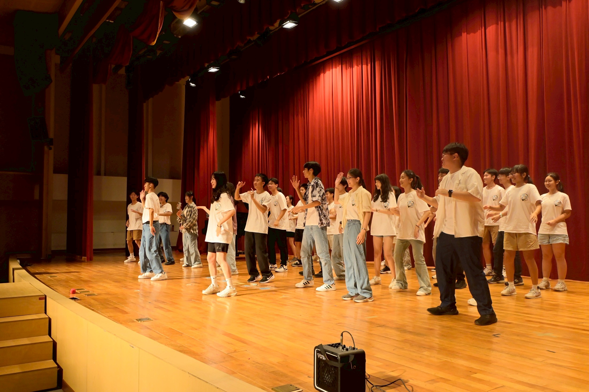

#生研社是什麼樣的社團?
生研社不僅是一個學術性社團，同時也是一個會舉辦很多活動的社團，讓學弟們能夠有玩也有學
#暑訓、寒訓在幹嘛?
在各種精彩的活動中學習，例如醫學院參訪、野外探索等 還有精彩的晚會活動等你來參加!
#對學習歷程有幫助嗎?
當然有! 加入生研可以獲得豐富的學習歷程，同時也能做許多專業方向的研究!
#有沒有友社?
有!北一、附中、成功、中山、景美都是我們關係很良好的友社喔!

