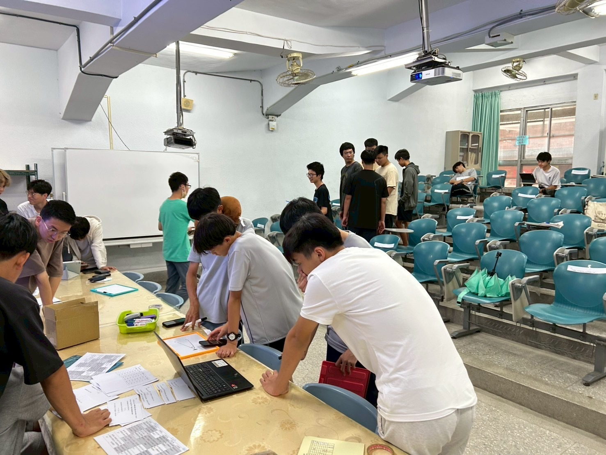
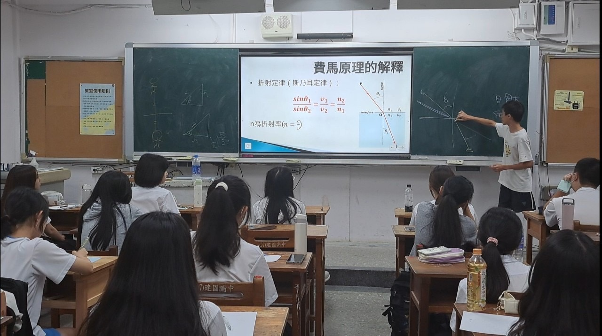
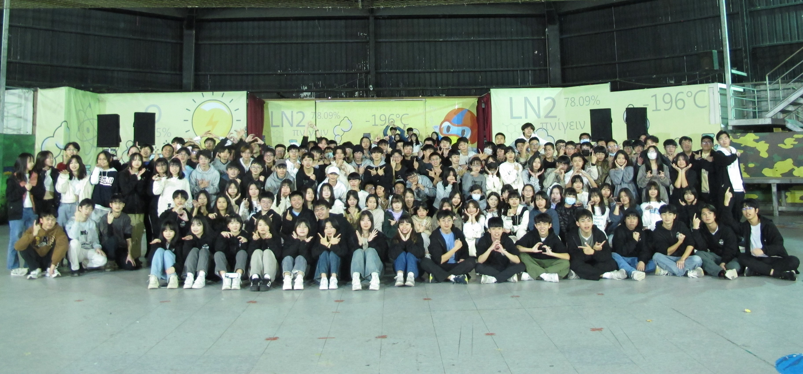

# 社團介紹 
我們是專注於物理領域的學術性社團，這裡沒有學長學弟制，每位成員都能自在地發展自己的興趣。無論是剛加入的高一，還是已有經驗的高二同學，彼此之間都能自在交流、互相學習。在物研，大家可以深入探討各種物理知識，找到屬於自己的熱情與方向。這裡不只是一個學習的空間，更是一個能交到知心好友、一起激發創意的地方。我們也沒有留幹制，只要你對物理有熱忱、願意投入，就能持續參與，成為這個重視探索與分享的大家庭的一份子! 

# 課程介紹  
社團課程分為週五社課、小型社課和與友社合辦的聯課活動。除了每週五的社課為固定參加外，小社課和聯課則採自願參與的方式。

週五社課與小社課 ： 
課程將從介紹物理常用的數學工具開始，奠定理解進階物理理論的基礎。接著，學長們會逐步帶領學弟從古典物理，慢慢進入現代物理的核心領域，包括狹義相對論、廣義相對論等主題。整個過程會循序漸進，課堂中或私下皆可隨時提問，不用擔心跟不上進度。經過一個學期的學習，將能掌握這些關鍵物理理論的基本概念與數學架構! 

聯合社課 : 
我們還會與其他友社合作舉辦聯合社課，內容不只侷限於物理與數學，還涵蓋生物與化學等多元學科，讓你一次滿足對自然科學的所有好奇心！在這樣的跨校活動中，不僅能學到新知，還能認識來自其他學校、同樣熱愛學習的夥伴，交流想法、激盪靈感，讓學習變得更有趣、更有火花。不但能拓展視野，還能拓展人脈，真的賺爛！

# 活動介紹 
除了專注於學術內容，我們也規劃了各式各樣的活動，讓成員們能夠彼此熟識、建立深厚情誼。從茶會、迎新、秋遊、聖晚、寒訓、元晚，到由高一成員親自籌劃的社展、春遊、送舊、暑訓和暑期營，活動豐富多元，每一場都是難忘的回憶。這些活動不僅讓大家迅速與同屆夥伴培養感情，也提供機會認識來自其他友社的朋友，彼此交流、一起成長。我們也設計了許多有趣的環節，像是團康遊戲、學術課程、故事尋寶 RPG，以及熱鬧的晚會表演，讓每一次參與都充滿歡笑與驚喜!

加入建中物理研究社!你可以隨心參加自己感興趣的活動，從不強迫，讓學習變成一件輕鬆又充滿樂趣的事。如果你渴望探索新知，想體驗一段豐富而有意義的高中生活，還能打造獨一無二的學習歷程，這裡就是你的最佳選擇。
更重要的是，物研是一個充滿支持與友情的大家庭。不管是課業、感情亦或是生活上的問題，我們都能給予你協助和建議。我們誠摯邀請你一同加入，用熱忱點燃未來，一起創造屬於我們的精彩高中回憶！

