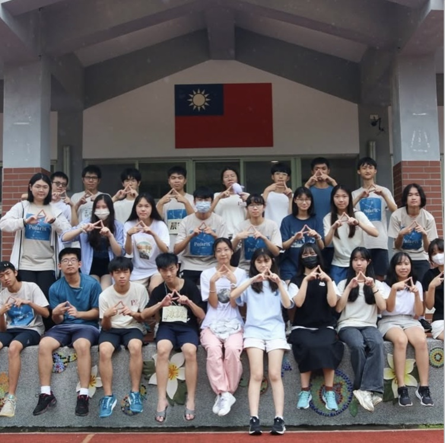

# 北集星Polaris

北部集合起來的觀星組織！集合了建中天文、北一天地、中山地科、萬芳天文的四校聯合組織，成立以來已達到第22屆，是最常一起辦活動的友社大家庭，加入建天不管正地社就是北集星的一員囉～快來在星空下認識夥伴們，北集星的大家都歡迎你！！

# 問題Q&A

1. 通常社課上什麼？
觀測、理論、星座神話星官等各種與天文有關的內容
2. 友社有哪些？
主要和北集星 友社互動:北一天地、中山地科、萬芳天文 有時候會參加例如成功天文社展、建景(美)武(陵)出觀
3. 活動的頻率？
大約一個多月一次，通常排在段考以後，中間有時候會有聯課(建中山聯課、北集星聯課等)活動都是自由參加喔
4. 有自己的儀器嗎？
有，因此若天氣狀況允許隨時能進行觀測！
5. 有無學長學弟制？
沒有喔！學長反而像學弟(x
6. 有無小社課？
有 內容多元又有趣喔！！
7. 能否地社？
當然可以！除了週五正社課其他活動皆能參與！(地社表單請見社帳)
