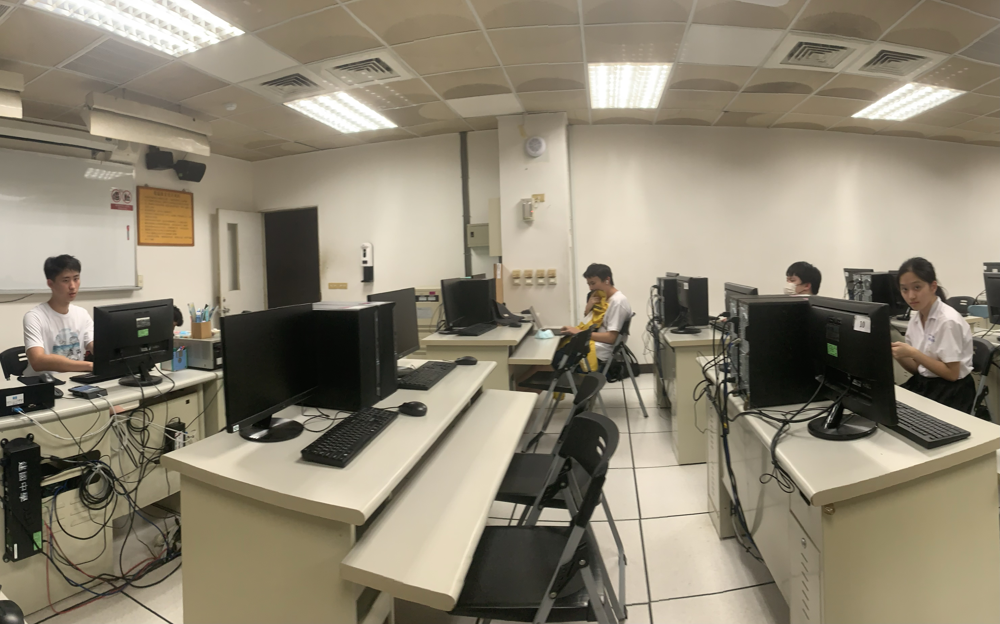

# 電研在幹嘛？

電子計算機研習社，簡稱電研，主要在學習各種資訊相關知識，如 Unity、機器學習、C++、網頁製作、資安......等各種東西，遠不只寫寫程式。可以來找各路電神||或是也可以來電我們||。除此之外，也會定期舉辦各種活動出去玩，增進大家的友誼。不需要有甚麼資訊基礎也ok。還有，我們和北一資訊研習社(北資)關係密切，可以看做同一個社團，合稱**建北電資**。

# 小社課

每週五天放學，都有不同的課程。這完全是自由參加，你可以每天都肝或是選有興趣的。教課是由高二的學長姊們上課。上學期會有 C++，Python，Unity，資安，網頁課程；課程內容都是*從0開始*，不用擔心沒基礎。當然，你已經超強的話也可以多多找學長姐們交流。

# 四大遊祭

我們有很多活動，主要是高二會辦給高一的四大遊祭 — **暑訓** ~~(剛剛結束)~~、**秋遊、寒訓、春遊**。除此之外，也有很多其他活動，像是迎新，幹見、社展等等。像是最上面的大合照，是邀請各校友社參加的茶會。平時大家也都關係很好，像是小社課完常常會約個晚餐。

# 溫暖的大家庭

我們不搞甚麼學長學弟制，正地社也一視同仁 (我們就很多幹部都是地社的)。和北資關係也很好。Discord上，大家也常常揪寫程式 ~~和玩minecraft~~ 等等。~~俗話沒有說但~~我們會說：建北電資是一個溫暖的大家庭。畢竟是社團，開心最重要。最後附上社團的吉祥物鯊鯊。

對了這是我們的 IG，可以去看一看
[建中電研45th_IG](https://www.instagram.com/ckeisc_45th?utm_source=ig_web_button_share_sheet&igsh=ZDNlZDc0MzIxNw==)
