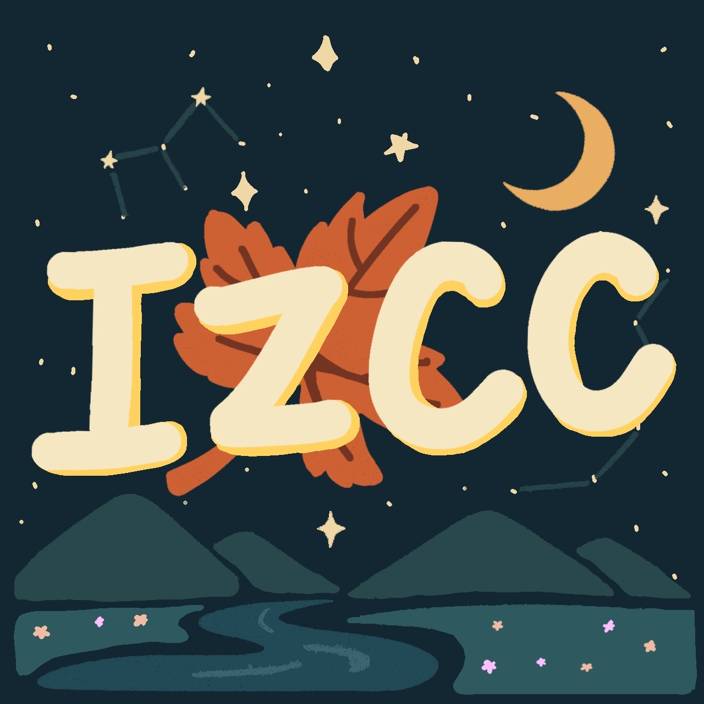
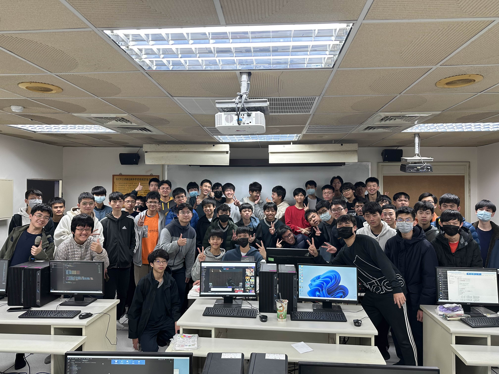

# 資訊社在做什麼

資訊社作為一個老牌社團，主要聚集了一群喜愛資訊領域的學長學弟們，由學長們帶領大家探索資訊相關領域，並互相切磋進步，大社課會由最基礎的語法逐漸深入，在每學期末會有讓大家展現實力的成果發表會，將在這一段時間內所學習的語法運用於實際生活中。

# 友社交流(IZCC)

升上建中，多數同學們最期待的便是與其他友校的交流，當然我們也不會少!! IZCC是由：建中資訊 (INFOR)、中山資研 (ZSISC)、成功電研 (CKCSC)、景美電資 (CMIOC)的合稱，在放學後會一起學習，開設小社課，並另外在課餘時間共同舉辦交流活動，如迎新、寒訓等

# 小/大社課

大社課是在每周五下午第一節課舉行，在大社課時間，學長們會講解各種不同的主題課程，包含:Python , C++ , 演算法，discord bot 等內容豐富課程，從初階認識一步一步學到進階應用，並在最後舉行成發驗收成果。

小社課每周一至五的放學後，IZCC會舉辦各式各樣的課程，會由各校學術來授課，也正是所謂的 ” 放課 ” ，預計會有演算法、C語言、網頁HTML、Discord bot、遊戲設計等課程，有基礎認識也有進階應用，且會從基礎講起，不用擔心太難聽不懂，有許多學長姐供你提問，放課是與學長姐、同屆一起切磋，同時增進自身學術力的一個好地方。

