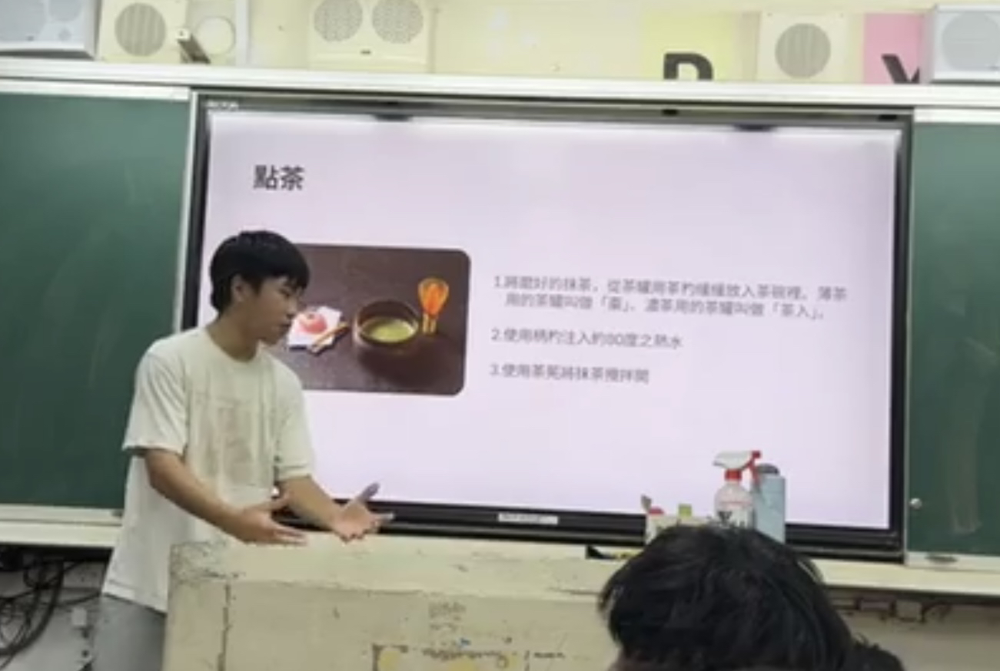
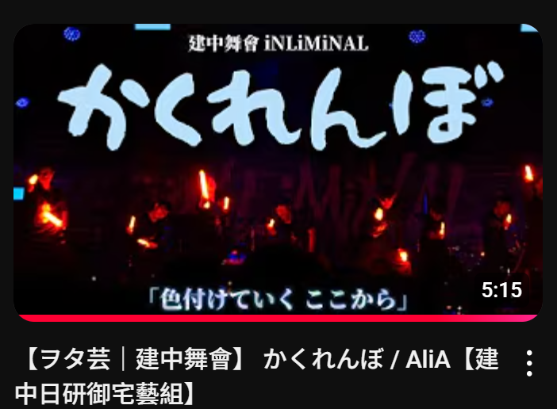

# 社課與小社課
週五的社課內容包羅萬象，從日系遊戲、動畫、漫畫作品介紹，到拉麵、麻將、文學、觀光、神話、宅文化等等，只要與日奔文化相關，都有機會成為我們的社課內容。
如果對日文有興趣的話，歡迎加入放學後的日文小社課，我們有專門的N1日文教學來授課，每週一次從零帶領你一起學日文，讓你進步飛速!

# 社團活動
日研會不定期舉辦各種如格鬥遊戲比賽、日文KTV團等，聖誕節時也有交換禮物環節。
也會與外校社團共同舉辦聯合迎新、成發等活動。

# 表演組
御宅藝作為日本知名應援文化的一環，建中日研的一大特色就是御宅藝組。
放學後會有超強大學長來教學，也可以一起在舞台上參加表演羨煞觀眾們。
本社也設有宅舞組，歡迎有興趣的學弟們參加御宅藝組及宅舞組。

 
# 超棒社辦
社辦位於致知樓地下室最後一間教室，有超讚榻榻米、一整櫃輕小說、漫畫、三台電腦及各種遊戲機，供社員一起同樂，有如你的第二個家。
