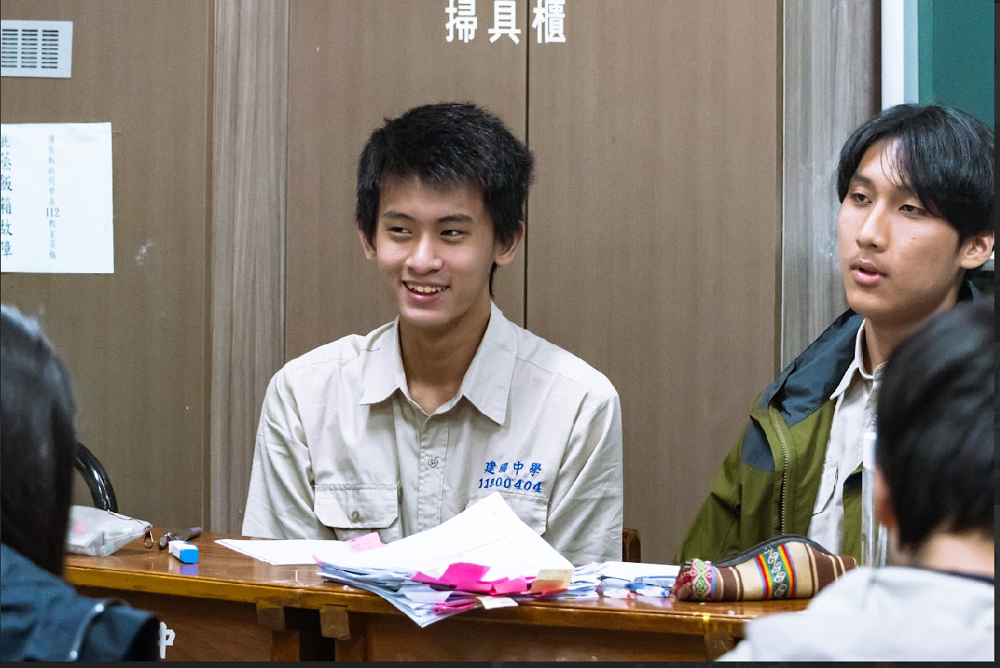
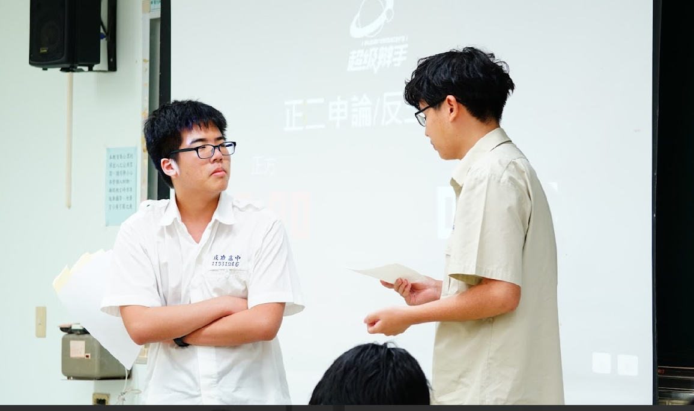
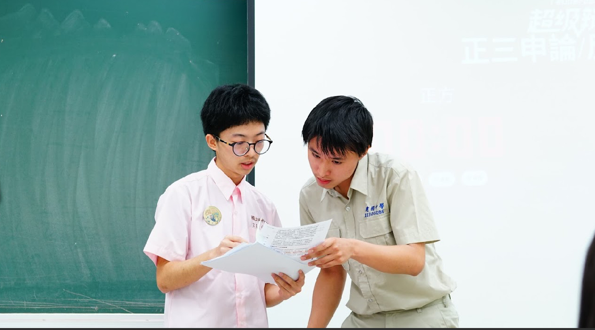

 
# 社團介紹：
## 我們在幹嘛：
總體來說，建中講演社是以華語辯論活動為基本的社團
社課：我們的社課會先從基本的辯論規則、概念開始，往下開始教授一些辯論場上的技巧。除此之外，我們的社課也會融入社會議題等其他元素，整體而言是既多元又充實！
課外：除了打辯論之外，我們整體調性是輕鬆和諧的社團。學長人都白痴白痴的不太會欺負學弟。此外，我們的社辦有許多桌遊，放學時間可以一起來玩，好好放鬆一下！
## 我們有什麼活動：
比賽：講演社會四處征戰大小辯論盃賽。在準備的過程中，不但可以增進對議題的了解、邏輯思維能力和看待事物的全面性外，一同出戰也增加了社員們的情感！
友校活動：我們有許多友校，包括但不限於北一、附中、松山，平時除了有機會和他們進行練習賽交流，更會一起舉辦聯合新生盃，聯合迎新、誕旦盃、春遊等等，等學弟一起參與！
## 進來能獲得什麼（社內）：
更強的資料查詢、邏輯思辨能力、更宏觀的看事情的角度
大量學習歷程的優質素材
一群很要好的朋友
（概率掉落）真正的最佳辯士頭銜！
陸奕安學長的簽名照！

# Q：辯論是什麼？
A：一般印象中的辯論比賽，雙方在場上各執一詞，或許會讓大家以為辯論就是用邏輯或說話技巧的方式吵架。但事實上辯論的本質是溝通與討論！因此，耐心聽對方說明，在場上取得某些部分的共識也是辯論很重要的一環，不是個個辯手都像立委一樣，質詢答辯時氣得臉紅脖子粗！

# Q：學長們會很可怕嗎？會有學長學弟制嗎？
A：我們沒有學長學弟制，誠如社團介紹所述，我們採「學弟學長制」，學長不會逼迫學弟在line群看完訊息後按讚，或是因為練習賽打不好就低閉學弟！

# Q：加入講演社有什麼幫助？
A：在能力上，除了流暢表達、邏輯思辨的能力可以在賽場上培養之外，準備各個辯題時，因為要準備不同持方，也會增進自身在看待一件事物時，能有更全面的視野！在升學上，辯論比賽的經歷也是學習歷程準備的良好素材，尤其是成為最佳辯士的經驗（前提是要是真的！）

# Q：完全沒接觸過辯論的人可以加入嗎？
A：當然可以！學長們基本上也是在完全零基礎的情況下開始的，學弟們不用擔心！

# Q：平時的比賽是怎麼準備、進行的？
Ａ：如果有意願要參與比賽的，我們會利用放學或假日的課餘時間聚集在一起討論，或與其他隊伍舉辦練習賽，雖然會佔用到一點時間，但對於比賽的準備來說是重要的環節外，對於自身辯論技巧的精進也很有幫助！

