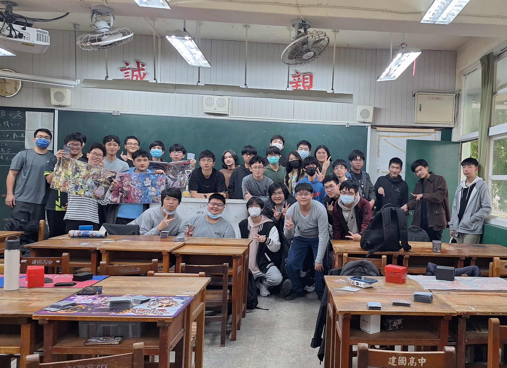
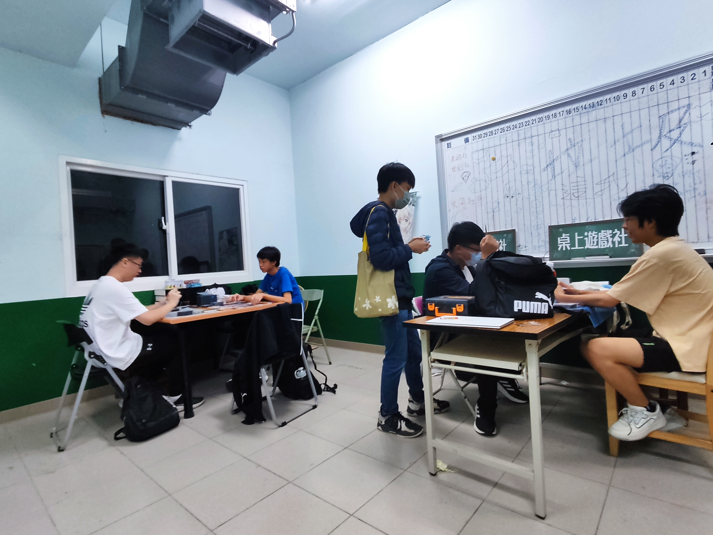

# 卡牌研究社是什麼
卡牌研究社是以近幾年逐漸興起的各式集換式卡牌遊戲為主題的交流向社團。我們致力於推廣並和更多學生分享卡牌遊戲的樂趣和獨特性。每年都會固定舉辦以學校社團名義出發的「建中盃」，希望能藉此提升本社團的知名度和鼓勵更多學生嘗試、體驗卡牌遊戲；此外，過去也不時會舉辦聯合多校的高中遊戲王賽事。本社團沒有學長學弟制，全憑實力說話（當然打不好也沒關係，我們會以友善包容的態度彼此交流、互相進步）

# 涵蓋範圍有哪些
前幾屆主要以「遊戲王」此款較為熱門的遊戲為推廣項目；本屆為了因應近年卡牌遊戲逐漸多元化的趨勢並且吸收更多社員以增加社團多樣性，開始推廣及學習不同種類的遊戲。目前主要涵蓋的範圍有「遊戲王 YGO」、「黑白雙翼 WS」、「寶可夢 PTCG」等，若有其他感興趣的卡牌遊戲（如最近比較火的「闇影詩章2 SV2」等 ）也歡迎加入我們。

# 社課在做什麼
目前社課為進行教學後開放自由交流之形式經營，不論是新手有興趣了解、入坑到比較資深的玩家間的牌技和牌組構築方面的研討都可以。順帶一提，夢紅樓地下室第七社團辦公室會於開放時間由社團幹部開啟並予以社員交流空間，就算不得已沒正社我們也能來找我們打牌交流喔！

