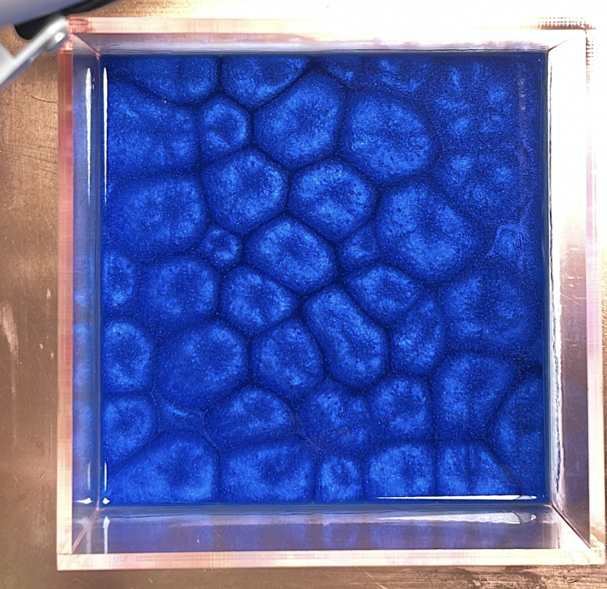
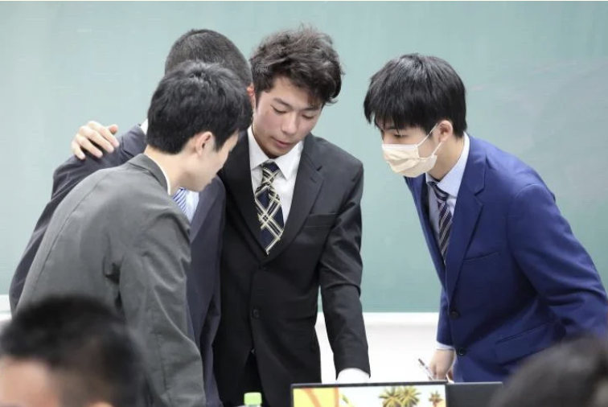
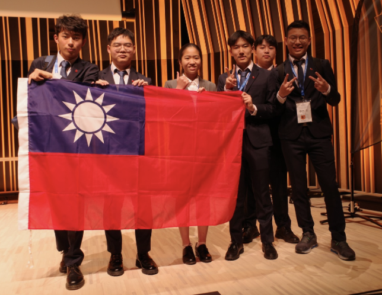

#  建中物理辯論社 CKYPT

## 🧠 什麼是物理辯論？

物理辯論（Physics Fights）是一種獨特的跨領域競賽：選手不僅要理解與實驗物理現象，還要能夠在舞台上，以嚴謹邏輯清晰表達、並與對手進行科學攻防。

建中物辯社正是專注於這場知識與口才並重的挑戰。從設計實驗、資料分析、建立模型，到站上台前展現成果、駁斥觀點──我們走的是一條從科學出發，邁向表達與批判思考的路。

---

## 🔍 我們怎麼做？

每年，我們從 TYPT（Taiwan Young Physicists’ Tournament）公布的開放式問題中選題，進行長達數月的研究與訓練。題目如：

- **Rayleigh–Bénard 對流**：液體受熱時如何產生規則對流？
- **磁鐵穿越線圈的能量損耗**
- **火焰如何在軌道中行徑？**

我們會根據題目：

- 查閱文獻，理解理論背景  
- 架設實驗裝置，反覆試驗  
- 撰寫數學模型，進行模擬驗證  
- 訓練上台報告、回答質詢與即席反駁

*▲ Rayleigh–Bénard 對流模擬，展示液體在溫差下形成的規律熱流模式*

---

## 🧪 社課內容與訓練流程

> 「物理不是書上的題目，而是我們每天不斷挑戰與發現的現象。」

社課依照不同階段安排內容：

- **前期**：題目選定、背景閱讀、基礎理論建構  
- **中期**：動手實驗、誤差分析、資料回歸、模擬建模  
- **後期**：簡報撰寫、上台演練、模擬攻防、問答訓練

此外，我們也會邀請**歷屆國手**與**學長回來指導**，分享研究經驗與答辯技巧。團隊內彼此討論與協作，互相補位，創造絕佳的默契。

---

## 🗣️ 賽場上的我們

物辯賽場不是背誦知識的地方，而是一場真正的即席戰鬥。每場比賽中會有三方角色：

- **Reporter（報告方）**：完整介紹實驗成果與理論模型  
- **Opponent（反對方）**：指出報告中可能的問題、挑戰假設  
- **Reviewer（審方）**：總結雙方爭點、提出補充與總評

我們的成員輪流擔任各角色，在壓力下進行有條理的邏輯思辨與即時應答。

📸  

*▲ 隊伍於 TYPT 進行報告與辯論*

---

## 🏆 成就與傳承

建中物辯社多年來：

- 多次進入 **TYPT 全國決賽**
- 養成多位 **國手代表台灣參加 IYPT（國際賽）**

*▲（右一） 今年國際賽比賽的學長*
在這裡，你不只會遇到挑戰，更會成長為具備獨立研究與科學表達能力的科學家。

---

## 👥 我們歡迎這樣的你

無論你是：

- 喜歡動手做實驗的實作派  
- 熱衷公式與推導的理論派  
- 邏輯敏銳、喜歡與人交鋒的表達派  

只要對物理懷有熱情，物辯社就是你發光的舞台。

---

## 📌 如何加入我們？

📍記得選社第一志願選我們！小社團只要選一定上喔👉👈
📢 社團博覽會展是我們的實驗可以來參觀喔！
📬 想了解更多或提早加入可私訊 IG ，我們也會陸續在那裡介紹今年的題目
