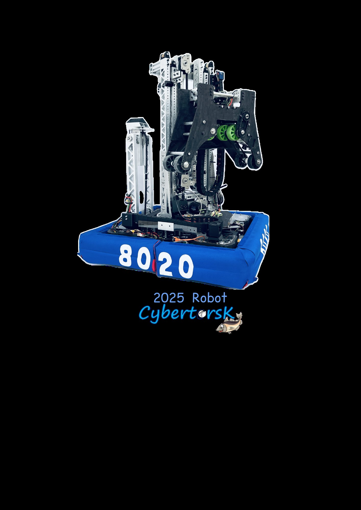
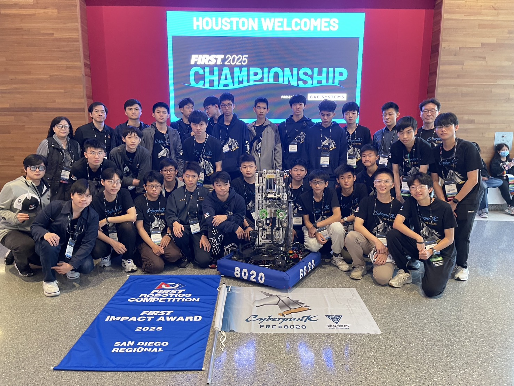

# 機器人時代不是未來，而是正在發生！

FIRST Robotics Competition (FRC) 是一個針對全球高中生舉辦的機器人競賽。在短短六週的時間內，學生團隊需要在嚴格的規則與有限的資源下打造出一台工業級機器人。
(機器圖片)

# 建中機器人研究校隊是引領創新的先驅者！

建中機研於 2019 年 9 月成立，FRC#8020 是我們的官方隊號，隊名 CyberpunK 隱含著建中的縮寫 C.K.，獨角獸穿著代表建中制服的卡其領子，想要傳達建中機研的精神：C.K.“Lead the Way”!

# 加入建中機研校隊的十大優點

1. 將學術理論實際運用於工程開發！
2. 不再只是 Maker，而是打造出一台工業級的機器人 !
3. 同學長期一起工作，團隊氛圍與默契絕佳 !
4. 學習如何經營與創立公司，找到最適合自己的職位 !
5. 充實高中生活，結交國內外教授及朋友互相交流 !
6. 出國參與國際競賽，增長見聞拓展視野。團隊每年安排台、美大學參訪
   (如台大、清大、MIT、Harvard、Stanford、UC Berkeley、Rice、Caltech)
7. 使用機器學習訓練視覺辨識模型，掌握未來關鍵的 AI 能力！
8. 學習英文演講，訓練表達能力！
9. 開發 APP，培養人因工程、程式設計能力！
10. 備審資料充足 ! 學長們皆成功透過學測或特殊選材進入大學！
    (台清交(含特殊選才)、倫敦大學 UCL、新加坡大學、加州大學 UCSD/UCI、
    萊斯大學、倫敦帝國學院、伊利諾香檳、普渡、紐約州立大學)

# 建中機研校隊的訓練從學術應用到科技整合，更包含創業準備、團隊合作、

解決問題、AI 應用和商業管理之多元能力，以培養其面對未來世界不同挑戰所需的素養與技能。我們歡迎更多新生加入我們的團隊，豐富你的高中生活！

FRC 比賽經歷 :

- 2023 Excellence in Engineering Award Los Angeles Regional
- Excellence in Engineering Award San Diego Regional
- 2024 Regional Finalist & Excellence in Engineering Award Long Island Regional
- 2025 Excellence in Engineering Award New Taipei City Regional
- Impact Award San Diego Regional
- Houston Championship Milstein Division Rank: 33/75

# 建中機研招生說明會暨面試

時間：2025 年 8 月 24 日(日) 11:00-18:00 8/23 20:00 前截止報名
地點：建中夢紅樓藝廊 (一樓)
流程:11:00 ~ 12:00 建中機研招生說明會 12:00 ~ 18:00 分組面試
報名連結:[https://reurl.cc/5RkNnR](https://reurl.cc/5RkNnR)

