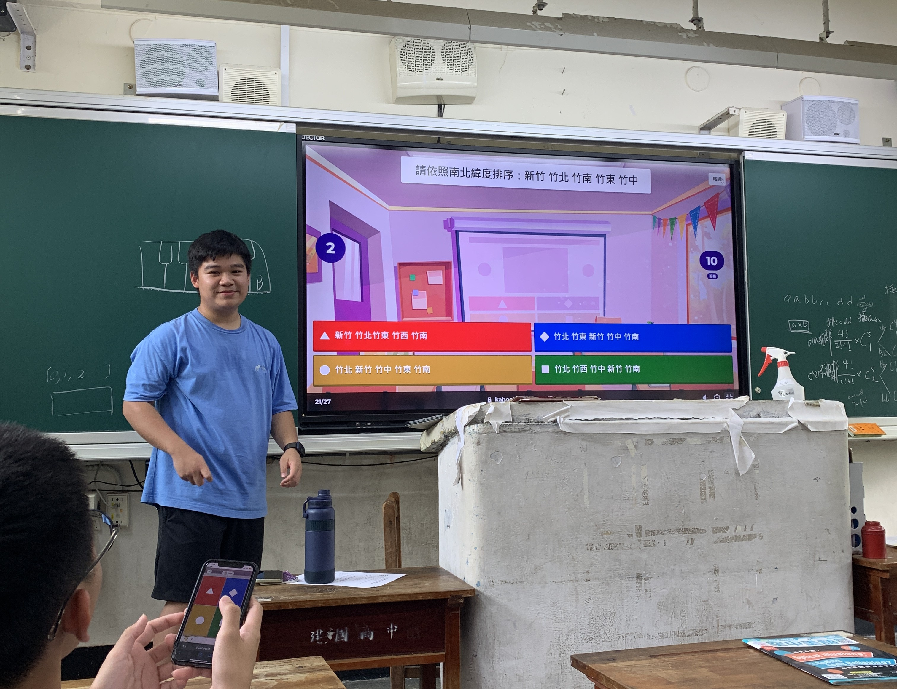
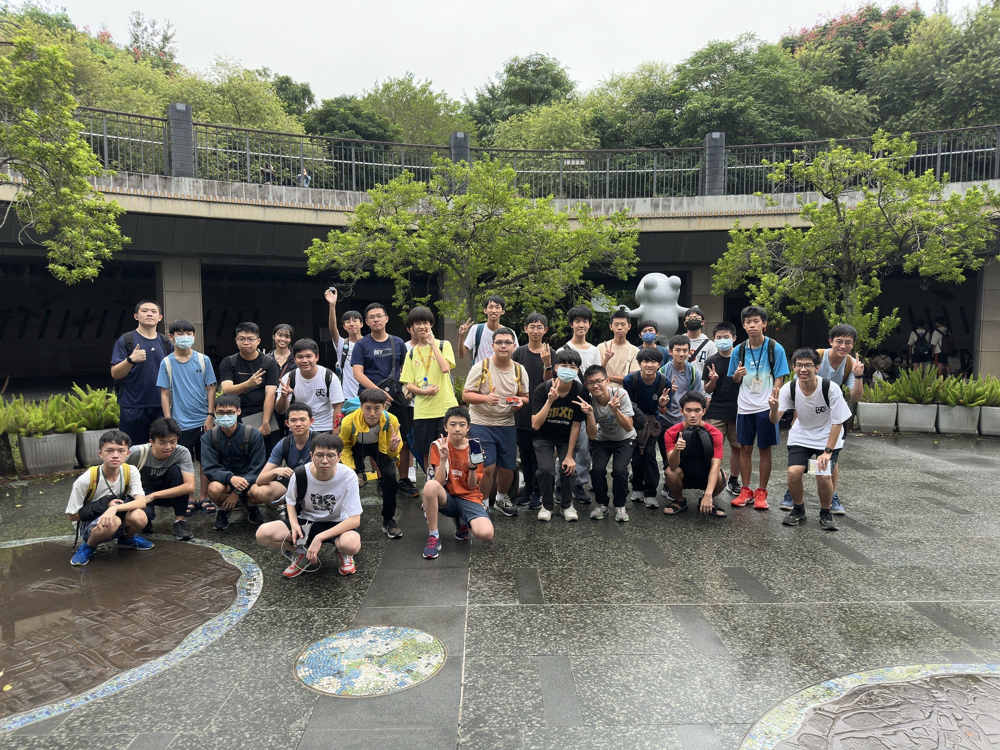

# 關於我們
　　世界地理探索社是建中第一個地理相關社團，目前是第四屆，最初是由一群熱愛交通及GeoGuessr的電神學長們創立。目的是希望能夠跳脫死板的課本知識，以有趣的方式去認識世界，並且和同儕們一同討論、切磋，在提升自己能力的同時，也找到與自己聊得來的好友。

# 課程內容
　　我們的社課會對地理的各方面進行介紹，內容包含GeoGuessr技巧、鐵道(捷運、鐵路、高鐵)、氣候等等。

# 活動
CK Geo大賽：
邀請所有對GeoGuessr有興趣的人(不限社員)一同前來，互相較量，也互相學習，也歡迎未參賽的人前來觀賽。
台北×捷運—城市定向：
利用各種大眾運輸，到達指定地點完成任務，將整個大台北地區變成遊樂場。
捷運之旅：
前往台北捷運高運量系統行控中心，揭開台北捷運的神秘面紗

