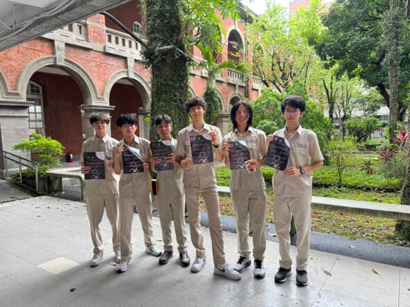

建中人工智慧研究社 CKAI1st 正式成立！

# 簡介
在資訊快速演進的時代，我們相信：
理解人工智慧，不應只是工程領域的專利；
思考未來，也不該只是旁觀者的事。
為什麼成立這個社團？
因為我們看見—
AI正持續改變世界的運作方式，而在建中這片豐富多元的土壤上，
我們希望補上一個聚焦於「AI應用與思辨」的角落。
這是一段新的嘗試，一個新的起點。
我們是誰？
我們不是專家。
我們是對科技懷抱好奇、願意親自實踐的學生；
💪我們相信技術不只是知識，更應成為連結現實與未來的力量。
我們的研究方向包含：
1. AI核心理論與應用實作
2. 大型語言模型與生成式技術探索
3. 跨領域專案設計與工程整合
4. 學術論文撰寫與成果發表
🌟一AI 的大門已然開啟，下一步，就等你一起加入一🌟
✨如果你也對這樣的未來有興趣，歡迎加入CKAI，與我們一同走向未來！
🔥CKAI - SEE the KEY, FLY the SKY.🔥

# 基本須知

* 實際業界指導老師教學🧑‍🏫
* 無學長學弟制😍

# 核心目標
在這一年中，我們將努力朝著以下四個目標前進：
1. 學習 AI 核心概念與應用🤖
從資料、演算法到模型部署，先建起基本骨架，再用實作喚醒肌肉記憶。
2. 運用大型語言模型（LLM）⚙️
嘗試理解LLM的機制並拆解其閱讀與生成流程，動手微調、打造小工具，讓文字成為最靈巧的介面。
3. 跨領域合作🤝
抓住每次機會，與機器人、設計或社科團隊協作，用AI補足不同領域之數據與創意缺口，同步磨練專案整合力。
4. 科研專題與論文發表📖
把實驗流程做成可複查紀錄，撰寫報告、發表論文，站上競賽與展覽舞台。

—四大目標，驅動未來引擎—

💡理論編碼|實作上線|協作集成|成果開源
這並非遙不可及的夢想，而是可逐步達成的理想。
👍CKAI 將持續努力、持續迭代，直到把理想寫進現實！
🔨如果你也想在高中階段一同嘗試建構這張藍圖，CKAI誠摯歡迎你的加入。
🪽一 AI 的大門已微微敞開，下一步，由你來推開一🪽

# 小社課

每週一次的小社課，帶你深入探索AI世界的核心奧秘。從基礎的機器學習理論到實務應用，再到進階的深度學習專案實作，我們一步步揭開人工智慧背後的原理與訓練技巧。不只學習，更要動手實踐！你將親自打造屬於自己的AI模型，從預測房價精準掌控市場，到訓練機器自動破關遊戲，各種挑戰都能輕鬆達成。讓我們一同證明：AI世界裡，沒有什麼是不可能的！🥳

# 關於我們

社團ig: @ckai_1st
王金程 社長ig: @winnerwang_8
劉品樂 副社長ig: @curtisliu0202
李奇融 公活ig: @edison_li_0707

誠摯的邀請你們！

