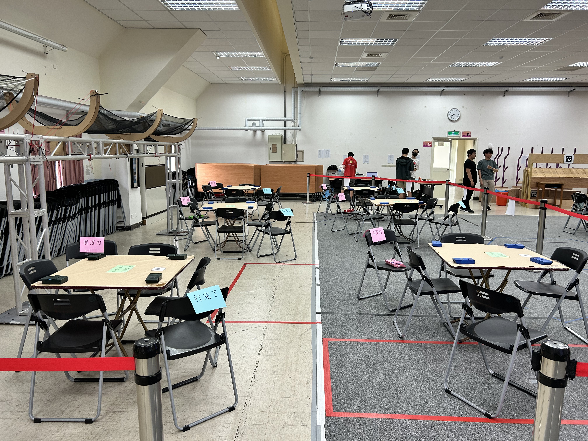
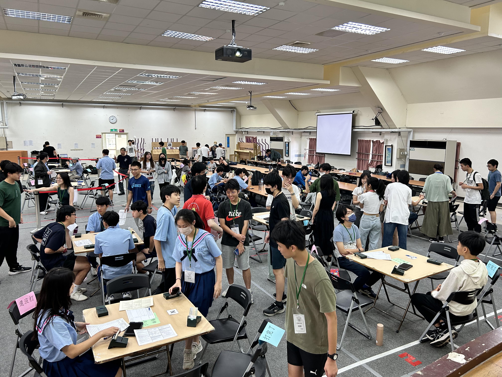

# 橋牌是什麼?能吃嗎?

合約橋牌是結合了邏輯推理與合作默契的公平撲克牌遊戲。橋牌在全球的普及程度極高，被認為是最具國際影響力的紙牌遊戲之一，巴菲特、比爾蓋茲、張忠謀、也都是其愛好者。

# 上課內容

由教學和指導老師以易於理解的方式講解基礎的叫牌制度和攻防技巧。課程中也會有自由時間，讓大家體會打牌的樂趣。學長、老師都很親切，沒有作業、考試，希望能給大家一個毫無壓力的環境，暫時脫離課業的壓榨。

# 其他活動

每週的星期一、四，放學後都會有小社課(自由參加)，可以來社辦打牌、精進自己的牌技。除此之外，我們也常常參加各高中、大學、橋藝協會舉辦的比賽，以及我們社團辦的紅樓盃。

# 友校與社團資訊

建中橋藝社的友校非常多，包含北一女、附中、中山、成功、景美等。
如果有其他問題，歡迎私訊我們的IG社帳
