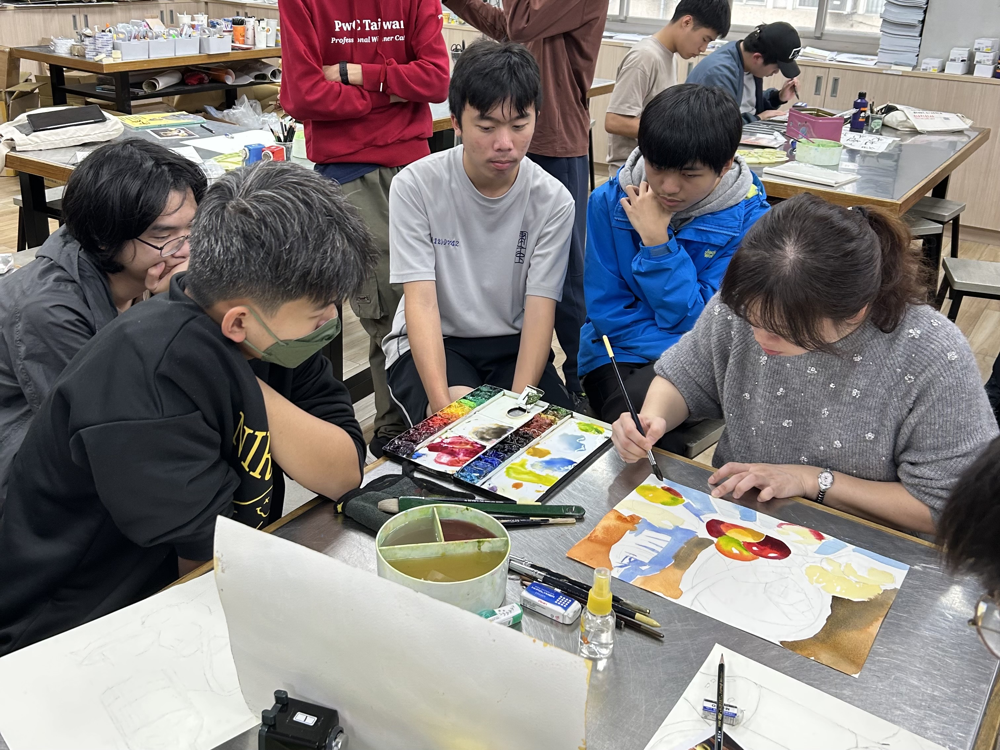
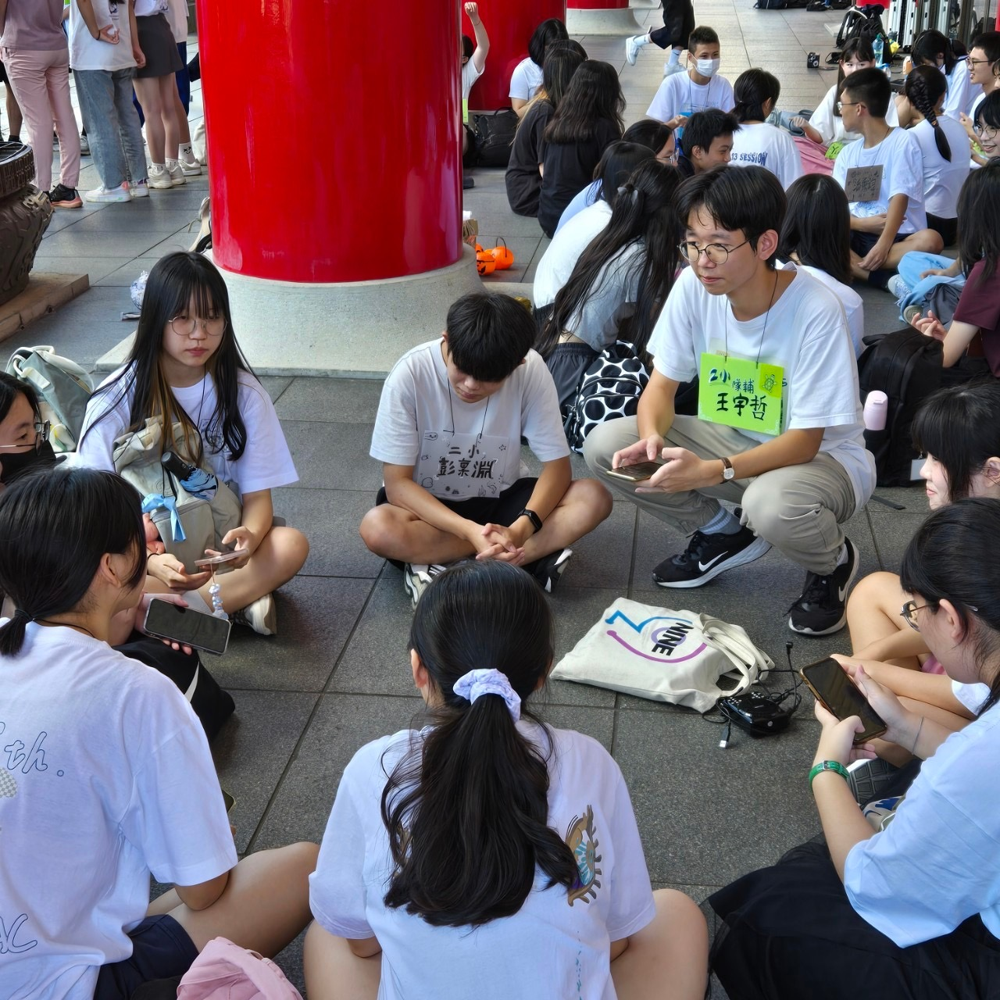

# 美術社在做什麼？
我們每週固定在美術教室上課，提供一個自由、舒適的創作空間。就算是零基礎也不用擔心，我們會從頭教起。學期末我們還會舉辦小聚會，讓大家都有機會欣賞彼此的作品、分享心得，可自由參加。

# 社課能學到什麼？
我們的課程內容多元，包含素描、水彩、書法、壓克力與電繪。每堂課都有專業的老師與溫和的學長耐心指導，從構圖到上色，遇到困難也不用怕，一步步帶你成長。

# 只要有興趣，你就適合
不論是想精進技法，還是想找人一起畫圖放鬆心情，只要對美術有一點點興趣，都歡迎加入我們，一起創作、一起成長！

# 有哪些友社與跨校活動？
我們會與北一、松山、政附、板中、和平、內湖、景美、新莊、永平的美術社團合作，聯合舉辦迎新、聯展等活動，讓你有機會分享作品、認識來自各校的藝術同好！

# 風氣自由，沒有壓力
建中美術社是個友善開放的社團，沒有學長學弟制，學長們也樂於傾聽學弟的想法與建議。這裡是一個可以安心做自己的地方，不需要比較，也不需要拘束，你可以專心畫畫、自由創作。

# 加入我們吧！
如果你正在尋找一個可以放鬆心情、盡情畫畫的社團，或是想交到一群同樣熱愛創作的朋友，建中美術社等你來加入！
歡迎追蹤我們的社帳，有任何問題都可以私訊～
