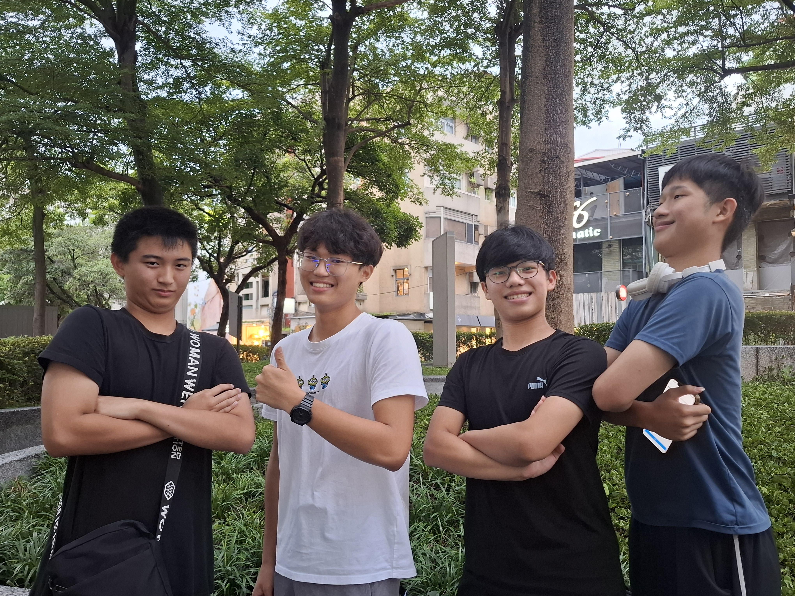

# 口技研究社是什麼?
我們是本校唯一專注於人聲節奏藝術(Beatbox)的社團，致力於推廣口技文化，讓每位學生都能用自己的聲音創造節奏與音樂！
無論你是新手還是已有基礎，建中口技都歡迎你的加入！
# 學習內容
基礎教學： 從簡單的 B、T、K 開始再到後面各種酷炫bass及特殊音，帶你從頭認識 Beatbox 各種技巧
實戰演練： 定期驗段子、舉辦社內 Battle ，讓大家實際運用所學。
成果發表： 參與校內外表演活動，如舞會、社團聯展、大成等，展現我們的聲音魅力！
交流合作： 定期與友社（如建中流音、中山樂創、中山阿卡等）聯合練習與演出。

                              

# 社團特色
🎤 不用樂器，只用一張嘴，隨時隨地都能玩出節奏與風格
🎧 學會控制呼吸與聲音，提升自信與表達能力
🔥 社團氣氛自由、創意十足，人人都有機會上台表演！
# 加入我們
如果你熱愛音樂、喜歡創新、想挑戰聲音的極限，不想去無聊的學術性社團，想隨時隨地炸爛你的朋友，成為西格碼🗿🔥🔥🔥🔥
那就別猶豫，加入口技研究社，跟我們一起「用嘴巴炸翻全場」!

