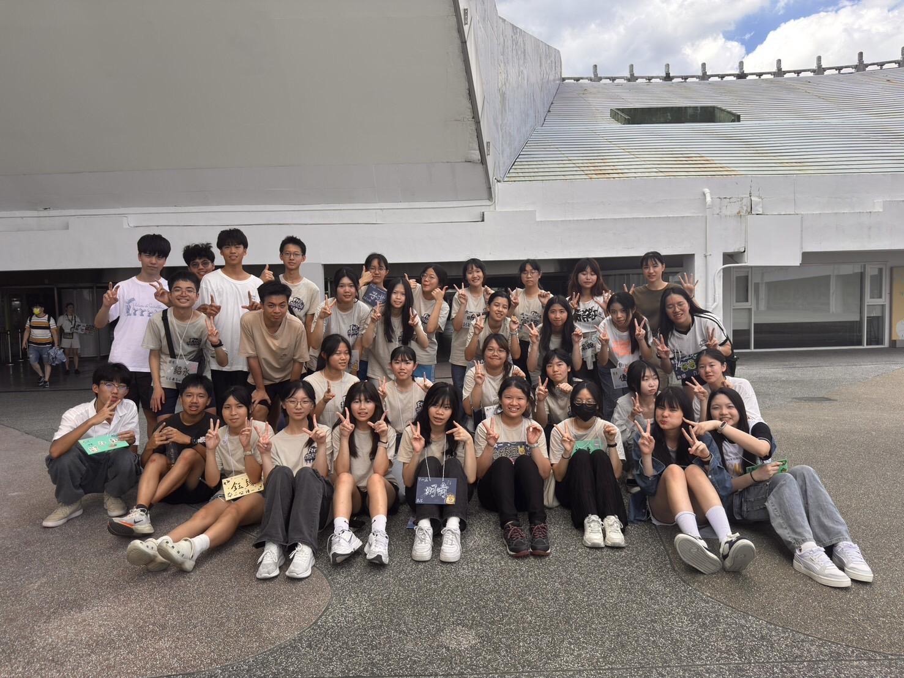
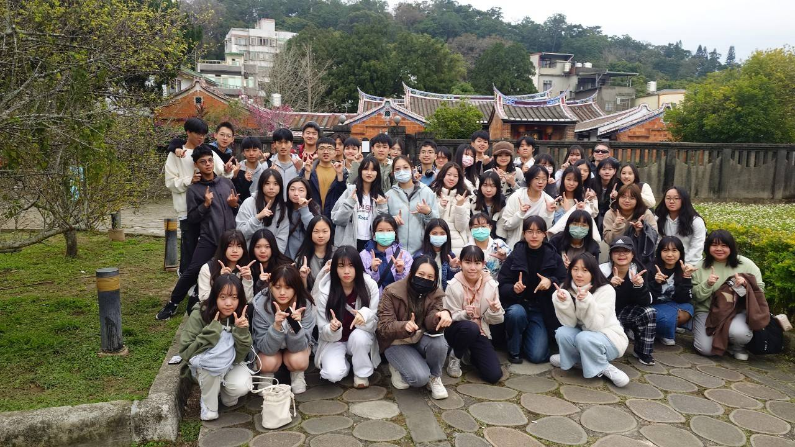
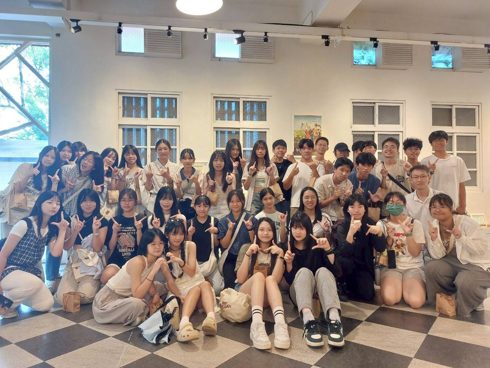

書可以不讀 (誤)，但飯不能不吃!
建中美食社是一個對外活動豐富的才藝性社團，每次段考結束都有一場與友社共同舉辦的活動，寒暑假各有過夜的食樂園四校(建中、中山、北一、景美)活動，每周社課學長們將手把手帶領學弟烹飪品嘗各國美食!!

# 食樂園寒訓!

寒假期間的寒訓是四校第一個三天兩夜活動，以 2025 年寒訓為例，學長姐與學弟妹一起前往台中旅遊，不只有好吃的——我們一起騎協力車在湖邊追風、揮汗參加超刺激的雷射槍戰，還有最重要的：##親手下廚、一起吃飯、一起笑！##
晚會笑到炸裂，友情濃到滿出鍋邊！
如果你也想用美食交朋友、在冬天找到暖暖的歸屬感，建中美食社等你一起開飯~
筆者也是在寒訓中認識超多友社夥伴，建中美食社可以說是筆者認識最多友校朋友的地方。

# 食樂園送舊!

食樂園送舊是四校第二次過夜活動，在暑假期間舉辦。
歷年四校送舊代表一種傳承，學弟妹為將面臨學測的學長姊策畫一次旅行，這趟旅行正是對學長姐一年多經營成果的肯定， 也是學弟妹最真摯的祝福與承諾。本次送舊前往宜蘭參觀在地美食、自然生態、人文美景，包含橘之鄉蜜餞故事館、斑比山丘、羅東夜市等地。
第二天各社分別自由活動，2025 送舊建中美食社前往羅東市區體驗人文風景，筆者印象最深刻的是圍成好幾桌打麻將、玩桌遊那種嘈雜而溫馨的氛圍。

# 食樂園迎新!

食樂園迎新代表著四校首次見面，也是高中社團生活的起點，學長姐將設計大小活動讓所有人相互認識。
除了大小團康活動，上屆還包含打水仗等特別活動，澆滅酷暑，燃起、高中生 活、社團生活、美食生活的熱情!
筆者當初遺憾沒有填社團志願，第二堂社課完才轉社進入，炎炎夏日沒能玩水實屬可惜，筆者也提醒學弟記得選社! 記得選社! 記得選社!

# 食樂園秋烤!

段考過後，一起烤肉放鬆吧!
與三個女校友社一起來場香氣四溢的青春聚會，團康活動結束後，學長姐準備木炭與食材，與學弟妹分組炭烤各式食材，涼爽的秋天就該添加一點青春的火花!!
筆者參加秋烤後，發現一堆朋友從這時候開始亂暈船哈哈哈哈

# 四校聯課!

暑假開始，食樂園四校齊聚中山女中烹飪午餐，為高中第一次暑假拉開序幕!
以 2025 四校聯課為例，分組製作了蛋炒飯、涼拌地瓜葉、桑椹汁，也建立了四校最深厚的情誼。
筆者同樣沒有參加這場活動，但聽朋友 2025 四校聯課是歷來最成功、最好玩的一屆，相信食樂園會年年步步高升。

# 各校聯課!

段考結束，建中美食社將依序前往景美女中、中山女中、北一女中聯課烹飪晚餐，聯課活動中不只增進成員的烹飪技巧，更是考試過後的一次放鬆。
筆者去過好幾次聯課，每次都有不同收穫，與好友共進美食，正是釋放壓力的最佳解方。

# 常規社課!

每周五的常規社課是結束一周繁忙、迎向假期的最佳方式。
午餐時間社員齊聚家政教室，由學長準備食材帶領學弟製作料理，讓所有人都有親自下廚的機會。
筆者認為，社課不只是一個吸收知識的地方，許多人會用剩餘食材開發奇奇怪怪的黑暗料理(雖偶有成功例子)，可以說是美食科學家的實驗室。

# 地下社團!

不同以往，本屆將地下社團制度化，每次社課前都將公布將製作的料理與價錢，建中所有同學到場一起製作!
除社課外，部分與友校的活動也歡迎所有建中學生參加，筆者當初聯課就帶超多班上同學去景美聯課。

太史公未曾曰:「課業日繁，心勞神困，誠當覓一寄託之所。予以為建中美食社，實最堪歸依之地。歡迎建中諸君共襄盛舉！」

建中美食社社團官方帳號: [ckdc_26th](https://www.instagram.com/ckdc_26th?utm_source=ig_web_button_share_sheet&igsh=MXh5MWlnMjhkeHg3Zg==)

建中美食社 Discord 群(所有人都能加入):
[https://discord.gg/hBCGAHHFZy](https://discord.gg/hBCGAHHFZy)

中山點心社社團官方帳號:[zsds27th](https://www.instagram.com/zsds27th?utm_source=ig_web_button_share_sheet&igsh=MWk5ODU4N3g2MGs0ag==)

北一點心社社團官方帳號: [tfgdc20th](https://www.instagram.com/tfgdc20th?utm_source=ig_web_button_share_sheet&igsh=MWV5NzNsNXhnbG02NQ==)

景美御膳社社團官方帳號: [jmlk25\_](https://www.instagram.com/jmlk25_?utm_source=ig_web_button_share_sheet&igsh=ZXJ0OWhiN3BodHNs)
