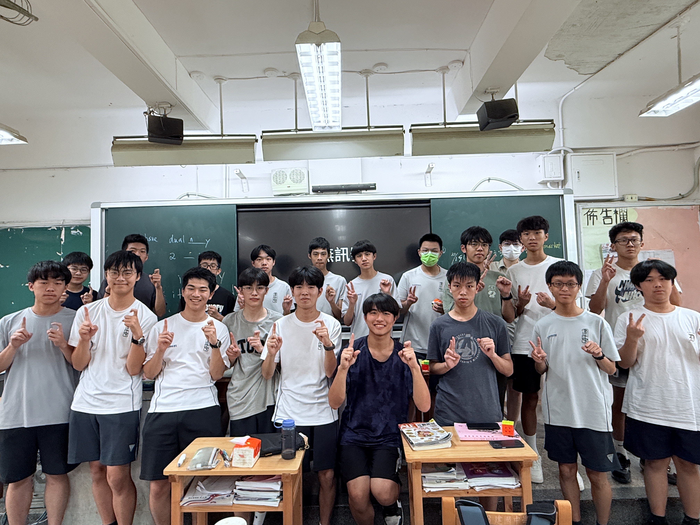
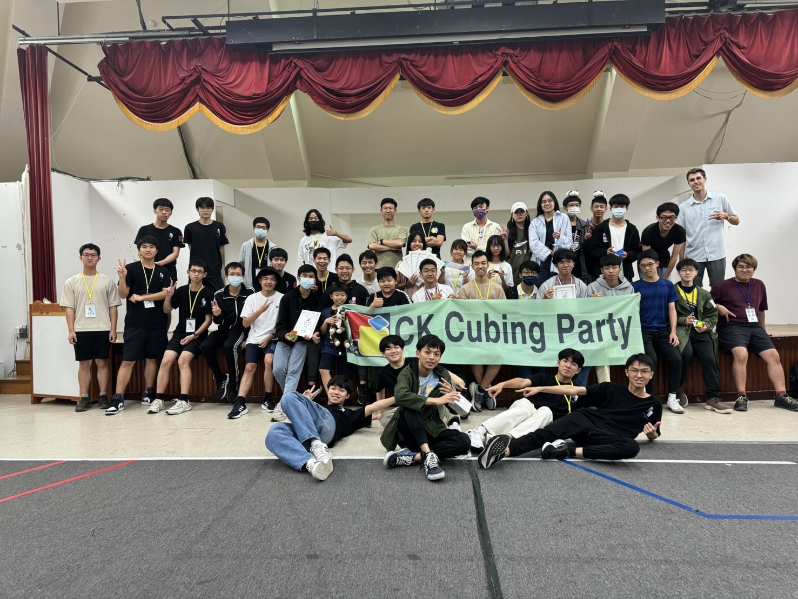

＃ 社團介紹
建中魔術方塊社 CKCubeClub(ckcc）顧名思義，我們是個玩魔方的社團，成員涵蓋新手到老鳥，無論你是想學魔方的新人還是想挑戰自我極限的高手，魔方社都是你最好的選擇。
魔方社有豐富的社產，除了三階、金字塔等基本款，也有各式各樣的「異形」魔方，讓人看得眼花撩亂。我們也有競賽專用的計時器等器材，讓你實際體驗參與正式競賽的感覺。
建中魔方社在台灣魔方圈小有名氣，甚至連亞洲紀錄保持人也是前建中魔方社成員，因此我們的教學師資也實力堅強，不時能邀請到台灣、甚至亞洲榜上有名的高手親自教學，絕對讓對魔方充滿熱忱的你收穫滿滿！

＃ CK Cubing Party
我們每年都會舉辦由世界魔方協會官方認證的比賽——建中杯魔方公開賽 CK Cubing Party。整場活動由魔方社成員親自籌辦，在這裡，你可以現場見識各路高手、彼此切磋交流，玩魔方的人絕對不能錯過！
百聞不如一見，趕緊加入我們吧！

建中魔術方塊社歡迎你！！
