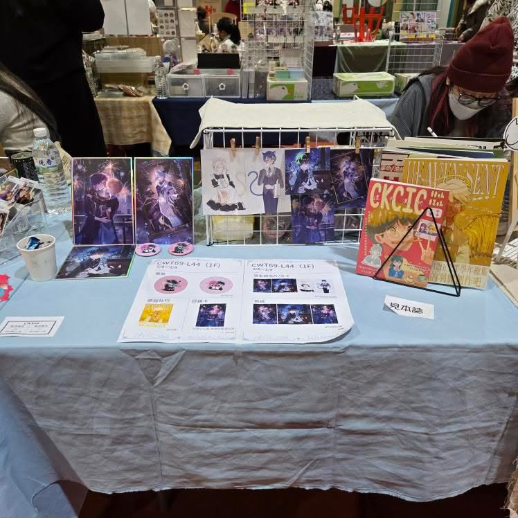
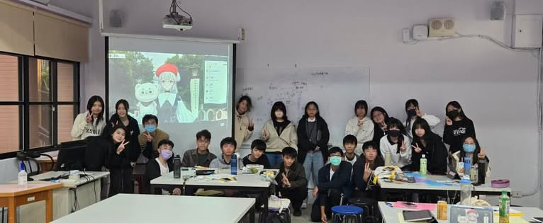

# 漫研是啥(´･ω･`)？
全名漫畫插畫研究社，簡單來說就是一個可以練習&學習繪畫(傳統畫法或電繪皆可ouob)和跟同好交流ACGN的社團，目前第13屆~  
不論是沒經驗的新手或是技術精湛的高手，只要有興趣都歡迎加入，地社也ok!  
社團活動主要著重在創作與交流，除了社課記得來之外基本上不會強迫參加

# 社團活動^_^
- 社課  
每週社課都會教一些繪畫的要點，學期初會先交比較基礎的技巧，再之後慢慢講比較進階和詳細的主題(ex:人體構造→上色&光影→角色設計→電繪技巧等)  
- 小社課  
可能是額外的教學，也可能是交流/遊戲時間，內容通常會在正社課公布  
- 每月徵圖  
每個月會訂一個主題來進行創作，把成果當作社刊素材，不會強迫徵收圖看自己想不想就好  
- 出外擺攤  
會去FF或CWT等類似活動擺攤，通常賣的是社刊、明信片、胸章、吊飾、小立牌等，如果自己有想出商品會給一定的經費支援 
 
- 外迎  
與他校舉辦的聯合外迎，跟同好多認識多交流的好機會(I人也適合) ，也是跟學長和同屆混熟的時機，可以看到他們跟平常不同的樣貌喔！
- 寒訓  
寒假期間會請講師來進行更專業的教學 ，除此之外還有很多好玩的活動跟互動，也是跟友社互動的機會

- 成發  
(應該)會與他校一起舉辦，社團一樣會擺攤，有意願的也可參加表演~
---
IG社帳: @ckcic_13th

