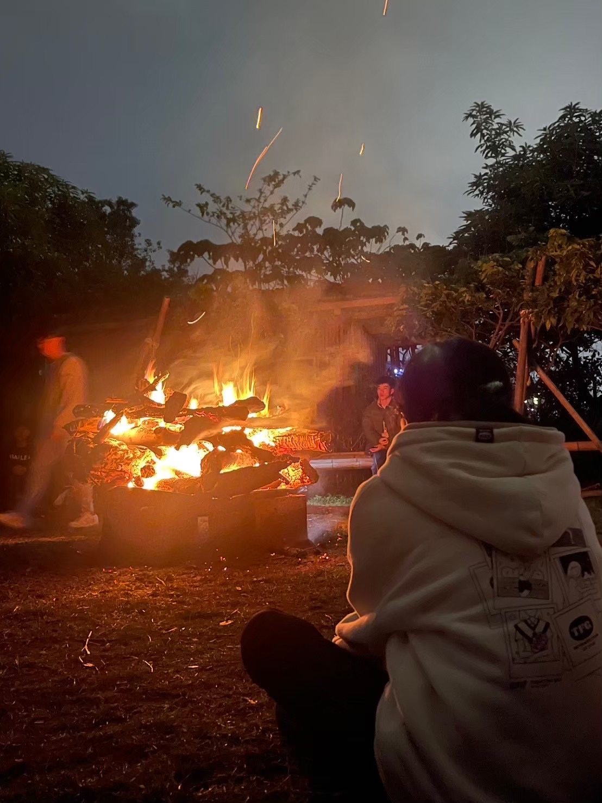

# 戶外探索社在做什麼？
去年我們辦的活動有:苗栗露營、聖誕露營、寒訓、觀星露營、單日活團康，以露營為主，是很好的機會接近大自然以及社員間培養感情

# 我是露營新手該怎麼辦？
完全不用擔心！想參加活動可以跟社團借睡袋，而且所有活動都會有熱情的長姊教你該怎麼做，只要願意聽一定能學會，讓你變成露營專家👍🏻
# 可以學到什麼？
我們社團前身為童軍社，露營活動中可以學到很多知識，比如生火、繩結、安全運用刀斧具等，還能在團體生活中學到如何和團隊合作，是提升自我的好機會
