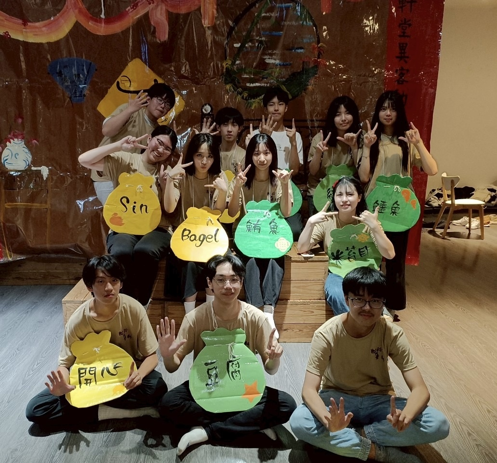
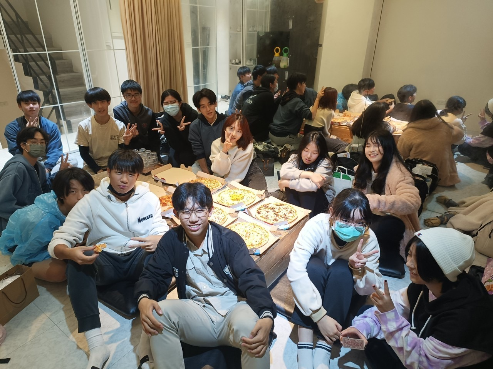

# 康輔社是怎麼樣的社團？
我們主要在辦活動的社團
活動內容包含了如各式戲劇、遊戲、RPG、土風舞、手語
可以有許多與友社交流的機會！

# 加入康輔社會不會沒有時間讀書？
在每一次活動中都可以選擇要參加多少活
也可以配合自己的時間安排來練活、活美
所以不用擔心會壓縮到讀書時間唷！

# 不擅長戲劇、舞蹈等表演怎麼辦？
都沒關係唷！
所有活動都是自由參加
可以找到自己最適合也會喜歡的活動
例如大地、團康遊戲或RPG等
而表演活也可以多多嘗試
說不定經過練習後也能得心應手！

# 個性比較內向適合加康輔社ㄇ？
可以的！
雖然康輔社會有許多與人相處的機會
但經過一起辦活、一起練活的過程之後
一定能在這裡找到高中階段最重要的朋友！

# 加康輔的優點？
可以學到很多課本上沒有，卻受盡其用的技能
例如美宣、領導、危機處理、公關能力等
讓你十項全能！
也可以在辦活過程認識友社的康輔人
人際關係上也能獲益良多 ~

追蹤社帳！

