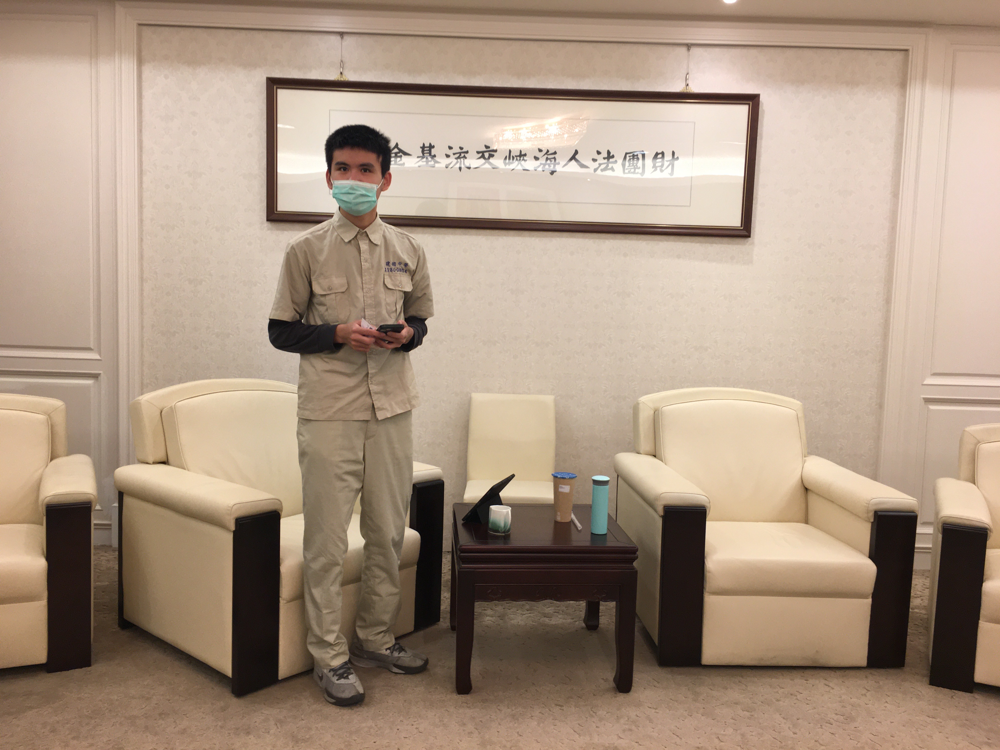
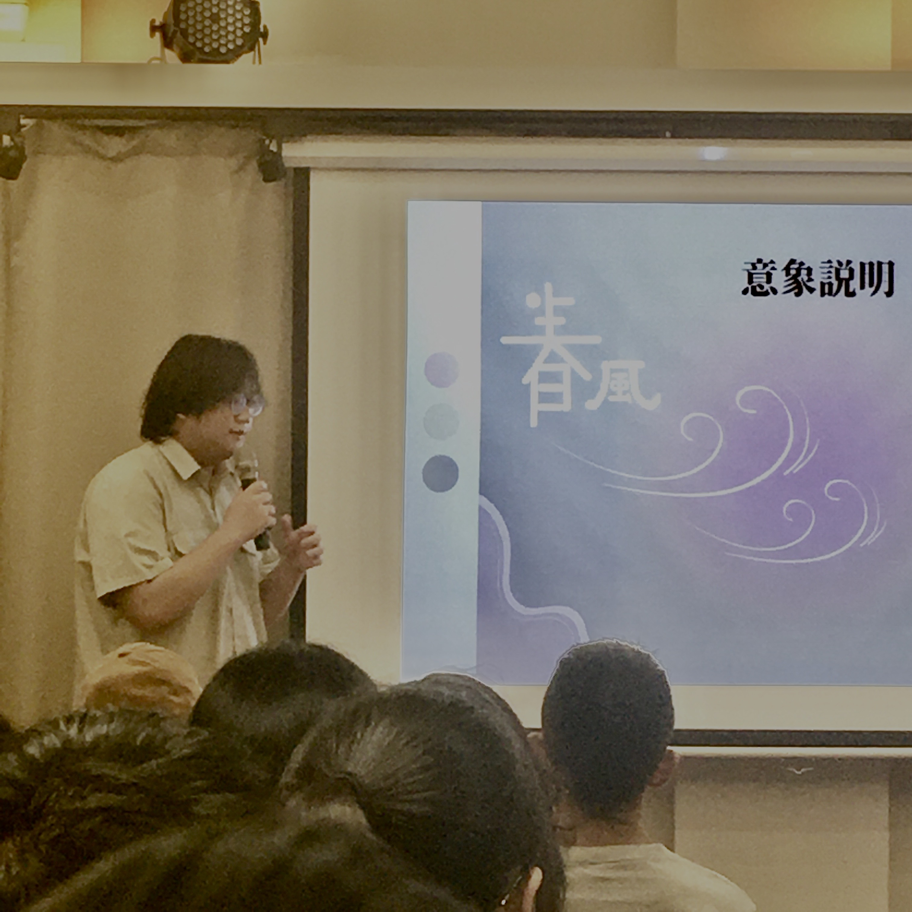
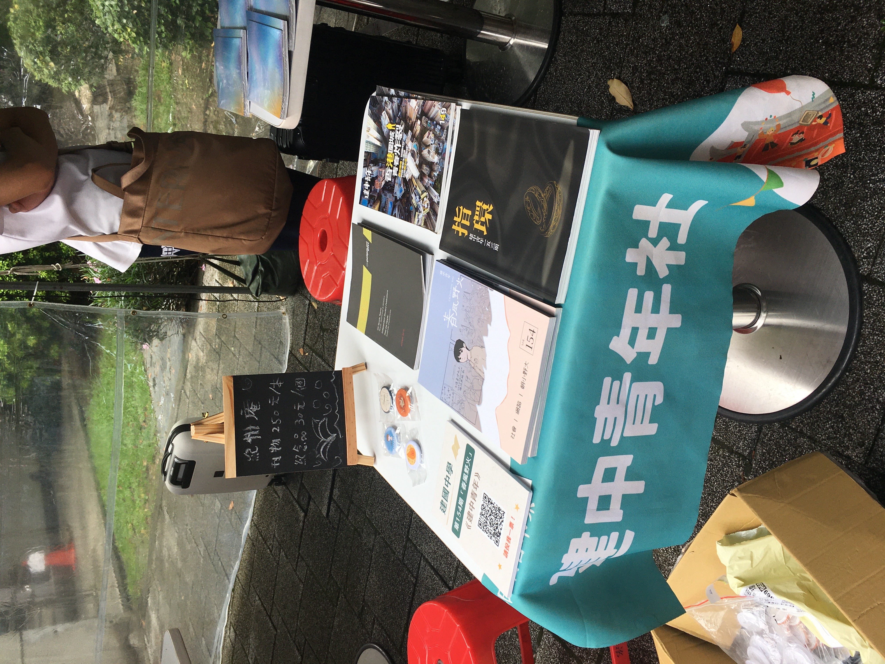

# 建青歷史
建中青年是一個屬於建中學生的獨立媒體。受到1915年陳獨秀所創立的《新青年》影響，一群對於對社會抱有理想、期盼改革的老學長們，創辦了如今的「建中青年」。縱使爾後面臨停刊，然而在復刊後，面臨的是當時黨國體制的監控，即使是由學生負責撰寫，仍難逃被審查的命運。然而，在時間的淘洗之下，建中青年已經逐漸脫離體制，儼然成為了一個獨立媒體。
自第133期開始，建青的刊物從強制訂購轉為自由購買；又於第142期時，因當時由該期編輯團隊撰寫之「解放乳頭運動」相關報導中的照片稍為裸露，引起當時的校方不滿，因而自該時起與校方脫鉤，不接受校方審稿，亦不接受校方直接補助。
十年來，從香港的反送中運動，到立院的朝小野大現狀；從紫背心校安，到一年前走入歷史的建中合作社。建中青年竭力扮演著第四權的角色，為自己所認同的價值發聲。以自己的表達，為這間學校、這片土地在時代的浪潮起落之中潮汐發電。

# 刊物編寫
現今的建中青年為每年一刊。在九月時會將該年度的刊物主題大致擬定，一路到寒假左右截稿。下學期開始，便會開始進行刊物的排版，而在春夏交接之際，一整年的心血結晶，便會在油墨香中，飛紅出來。
刊物內容的部分，會有一個大致上的主軸，但是每個成員也都有參與決定的機會，可以選擇自己想寫的議題。在建中青年，不需要委屈自己寫一些自己不想要寫的東西；亦不需要幫學校、班聯業配，淪為沒有主見的側翼。除了文字內容的撰寫，諸如排版、攝影、採訪、甚至封面制作都會由我們獨立製作，因此成員們也能自由選擇撰寫以外的工作。
在刊物製作的過程中，除了能在社課學到編輯刊物或是採訪技巧等知識，我們更重視的是以一個雜誌編輯者的角度，培養對社會議題的敏銳度，並輔以文字表達、呈現自己的觀點。

# 社課內容和社團活動
## －－社課內容－－

在每週五的社課當中，可以學到採訪技巧、美編技巧等編輯刊物的相關知識；有些時候，也會請在中央社擔任記者的社師授課，分享採訪、報導等相關經驗。在社課中還有議題分享、時事討論的機會，大家都可以自由的表達自己的意見，更有機會站上講台，向各位同學和學長們分享自己有興趣的主題！在期末也會舉辦讀書會，可以和大家討論分享自己鍾愛的書。

## －－友社交流－－

　　建青的友社遍布全台各地，從北北基的北一、中山、松山、板中，到中南部的雄中、雄女、屏女等等學校，也常常和其他學校辦活動。有像是讀書會、聖誕晚會等規模較小的聚會，或是在學年初和寒假也會聯合籌辦較熱鬧的秋烤、迎新以及寒訓。規模更大的活動有冬天的全國編輯交流會和夏天的紀州庵校刊競賽，可以和來自全台各地的校刊編輯們交流切磋，更有機會可以從中結識到志同道合、對文學和社會抱有想法與理想的一群好朋友。

## －－市集－－

　　每年十二月牯嶺街的書香市集以及七月的紀州庵刊物市集，建青都會在市集擺攤販賣刊物，可以在那邊認識到很多不管是對文學或是社會議題感興趣的人，也可以體驗到如何介紹刊物，以及與顧客交流刊物內容。

# 理念
建中青年社每屆最重要的成果僅是一份刊物，但在72年的積累下，已有了154本的豐厚成果，這一落落書籍乘載著一代代人的寶貴的青春歲月，以及他們對進步社會的期盼。
歷屆學長都十分懷念待在青年社的時光，也將這段時光視為他們生命中最自在、最幸福，也留下了重大影響的經歷，感受到「一群人為了同樣理想而奮不顧身」並經過無數個深夜的熱烈討論，締結深刻難得的情誼。
青年社刊物最引以為傲的，是獨立而深刻的報導，在尖銳的筆鋒下，流露出對身邊、對台灣、對世界的關切，志在創造一個能讓不同立場來相互碰撞磨合的平台。在大量資訊氾濫的潮流中，守住一個能自由創作、針砭時事的溫暖角落。
