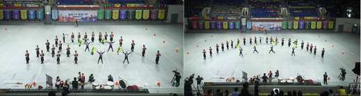
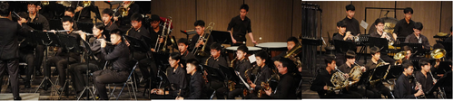
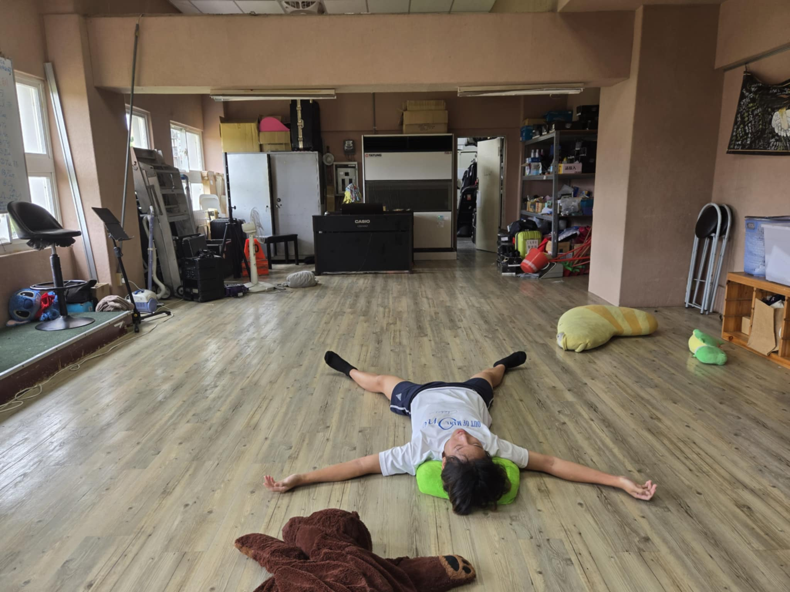

# 建中樂旗隊是什麼？
建中樂旗隊是一支室外行進樂隊，隊員們會一邊吹奏樂器、一邊根據設計好的圖形變換隊形，還會搭配旗隊的動作一起表演，樂隊也會整體的表演氣勢磅礡
。除了室外行進，也有室內樂的演出，兩者的重視程度相同。一年兩次的成果發表會也都是以室內的形式演出。

# 旗隊在幹嘛？
旗隊除了可以拋槍、拋旗以外，還可以執行一些特技動作，同時也可以用一些自製的道具進行表演。在旗隊能夠盡情發揮你的表演慾，展現最閃耀的自己。

# 表演機會
不只有校慶、全國學生音樂比賽，還有嘉義管樂節、樂儀旗舞和樂旗大獎賽，甚至還有機會在國慶和元旦這種大場合表演，除了國內的活動以外，暑假還能代表台灣前往世界各地比賽，像是WAMSB世界樂旗大賽...等世界級演出機會，如明年就有機會到荷蘭參加四年一次的世界音樂大賽。

# 在這裡你能得到
你可以培養額外的專長，樂隊可以學會樂器，並提升自己的音樂素養，同時還能提升自己的體力，旗隊則可以練出線條明顯的腹肌、二頭肌，學會拋槍、拋旗後可以隨手拿雨傘來拋，還能夠交到最知心的好友，在一同面對的各種表演、活動中，可以培養團隊合作的能力。且各種大型的國內外表演，可以拓展我們的視野，在我們未來的人生中能起到非常大的幫助。更重要的是我們有全建中最大的溫馨社辦，平常可以在裡面休息、讀書、練樂器，我們社辦裡還有一台超大冷氣，跟現在旁邊看到的冷氣長得一模一樣，就算是在夏天，社辦裡也能非常涼爽。此外我們還有各種與北一、景美一起舉辦的活動，如體驗營和聯合迎新……等，可以認識到許多友校的同好。

# 沒學過樂器也可以加入！
如果你對樂隊有興趣但擔心自己的音樂能力跟不上別人而非常猶豫的話其實不用擔心，本屆超過一半都是樂器初學者，經過幾周學長細心的指導後，就能得心應手並跟上大家的腳步

# 參加樂旗隊會不會影響到成績
在樂旗隊可以培養到許多能力，包括良好的時間管理能力，而這個能力也能運用到課業上，使我們到成績也能保持高水準，前幾屆學長的大學榜單也可以看到有非常高比例的人考上台大，其中也不乏資工、電機和醫學系等熱門的科系。

# 不來會後悔！
如果你不想當一個只會讀書的建中生，想要有不一樣的高中生活，那就來吧，這裡不會讓你後悔！！
