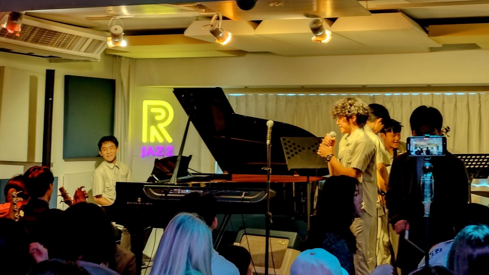
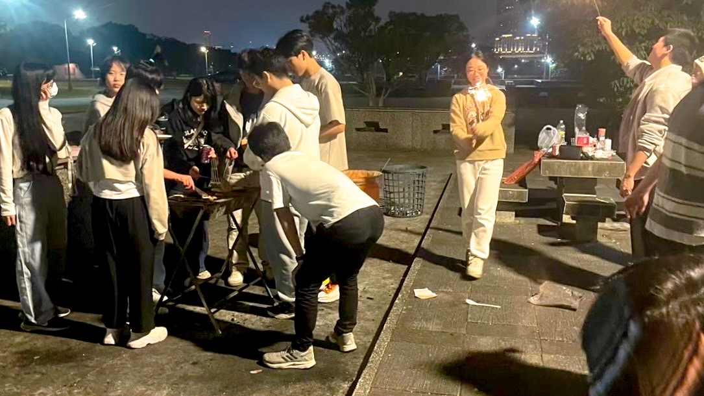

# 爵士樂是什麼

爵士樂（Jazz）是一種起源於20世紀初美國、以非洲裔美國人社群為主體發展出來的音樂風格，它結合了藍調（Blues）、Gospel、Ragtime和歐洲音樂（如軍樂、古典音樂）等元素，主要特色有：

1. 即興演奏
   爵士樂手經常在表演時現場創作，並非完全按照樂譜演奏，所以聽同一個樂手每次表演時都會有不一樣的感受
2. 搖擺節奏
   爵士樂在節奏上會給人一種搖擺的律動感，強調弱拍，使得節奏帶有律動與彈性
3. 音階與和聲
   爵士樂偏好使用特殊的音階以及和弦，來創造豐富的音樂色彩
4. 樂器自由性
   爵士樂的樂器種類有很多，像是：吉他、Bass 、KB 、鼓、薩克斯風、小號等等
   不同樂手會使用不同風格的樂器來展現個人風格。

當然，爵音社不會僅限於爵士樂，我們各風格的音樂都有涉獵，不論是Blues、Funk 、hiphop各類音樂風格的歌曲我們都會開

# 友社與活動

我們的友社有：附中爵音、北一吉他、北一樂創、中山爵音（新社團第一屆）
十二月左右會有跟附爵的聯展

寒假的春烤冬遊會跟北一女一起出去玩

在五月左右會有我們的大型成發

在爵音你絕對不用擔心認識不到外校（女校）的朋友（女生），只要記得不要自己咬到鉤子就好了
