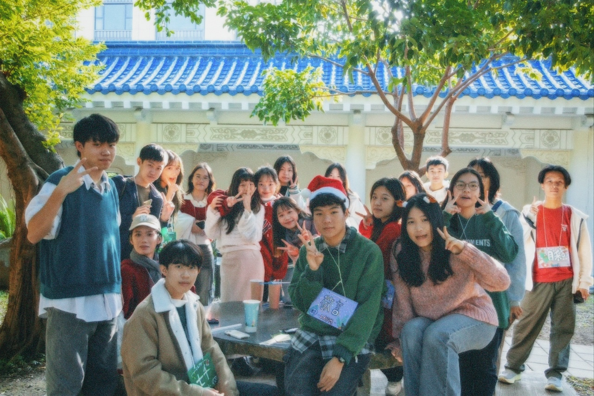
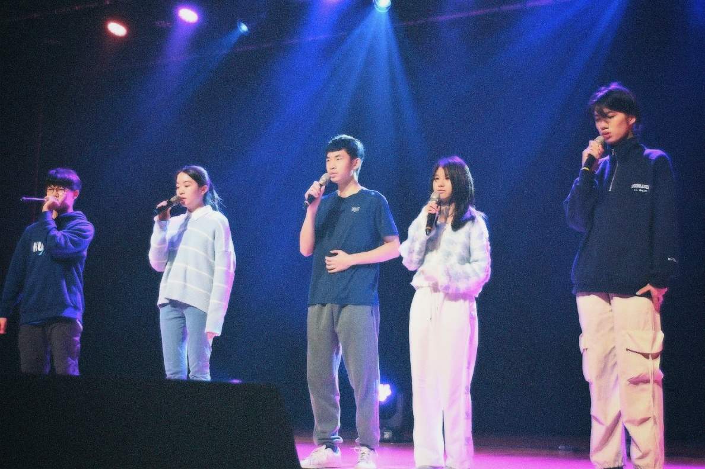
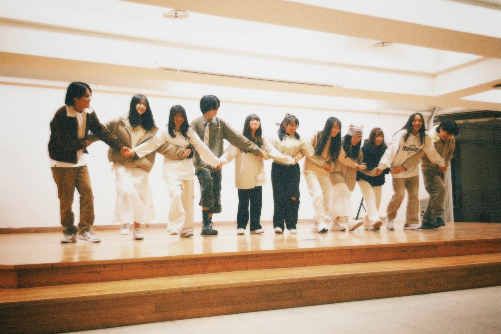

# 社課內容：實力與自信的養成

每週的社課是流行音樂社運作的核心，內容包含三大方向：歌唱技巧、表演訓練與樂理學習。從基礎發聲、換氣訓練、真假音切換，到音準穩定、感情詮釋與肢體表達，社課提供完整的歌唱教學。

除了技巧之外，我們也重視表演展現的訓練。透過模擬演出與舞台走位練習，社員能更自在地面對觀眾，提升自信。樂理課程則幫助社員了解音樂架構、和聲與常見和弦進行，讓每位社員不只是會唱，更懂音樂。

---

# 友校合作：跨校交流，共築舞台

建中流行音樂社與多所友校關係密切，包含北一女中、景美女中、松山高中與華江高中流音社。我們不僅在寒訓、聯課等活動中共同學習，也在展演中互相欣賞彼此的風格與成長。

這些友校合作讓社員有機會接觸不同教學方式與舞台形式，透過跨校合唱、團練觀摩與工作坊，不但拓展視野，也在音樂路上結交志同道合的夥伴。

---

# 一年四季，音樂不斷

建中流行音樂社每年活動不間斷，每一場都是階段性的成果與回憶。開學初的「大迎」迎接新血加入；學期末的「聖晚」以溫馨音樂為社團年度劃下句點。

寒假期間的「寒訓」是密集訓練與深度交流的時間，與友校共同練唱、切磋技巧；「聯課」則是在學期間由專業老師與五校共同進行的系列課程，加強音樂與表演能力。

最受矚目的活動莫過於每年春季舉辦的「聯展」，與北一流音及建中口技共同策畫，會加入獨特的阿卡貝拉表演，是兩校社員站上大舞台展現自我的機會；此外，還有對外交流演出如「大成」，以及專為學弟妹設計的初次成果發表「聯合小成」，讓每位社員都有舞台可展現。

---

流音是一段旅程，也是我們的聲音

在流行音樂社，我們相信音樂不只是表演，更是情感的交流與青春的紀錄。每一堂課、每一次練習、每一場演出，都是我們在歌聲中成長的證明。

這裡沒有完美的人，只有願意努力的你我。我們從零開始，互相支持，一起創造舞台，一起完成屬於我們的青春和聲。這，就是流音。

