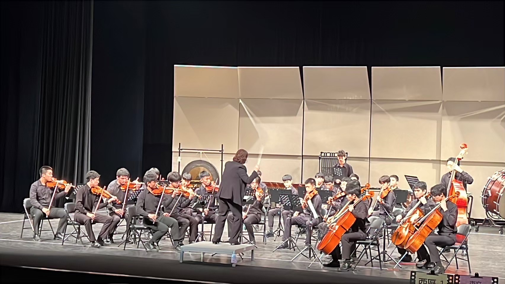
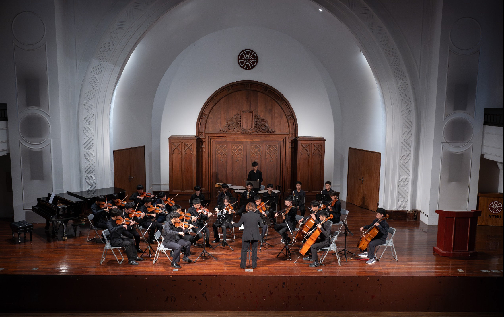

# 入團
加入社團無需甄選，如果沒有樂器的話我們有提供社琴使用。也歡迎初學者來嘗試看看！

# 小社課
小社課每週兩次由外聘指揮進行指導，分別是在禮拜一和二都是。禮拜一為管弦樂練習，禮拜二為弦樂練習。過程中由指揮帶著大家一起練習要表演或比賽的曲子。

# 舉辦的活動
🔸迎新
主要是為了迎接高一新社員所舉辦！
🔸聖誕音樂會
是建中管弦樂社第一場正式表演，將平時所練習之成果在舞台上展現。
🔸寒訓
通常辦在二月初，是認識友校同學的好機會 ！當中會一起練習曲子、遊玩各種遊戲，最後還會有成果發表來記錄大家的成果。
🔸小型成發
在寒訓大致認識友校的同學後所舉辦的八校表演。可以自己找同校或友校的搭檔練習，並在舞台上表演。
🔸大型成發
建中管弦樂社最後一場表演，在比完全國賽後所練習的曲子在舞台上一一展現！

# 全國比賽
每年我們會參加兩場全國比賽，分別是管弦和弦樂。

