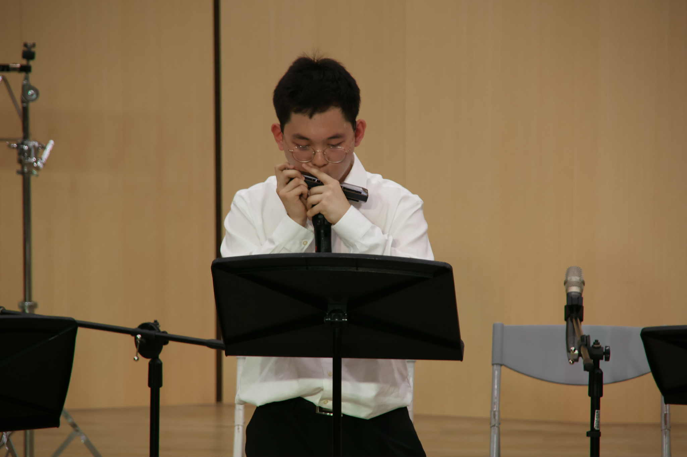
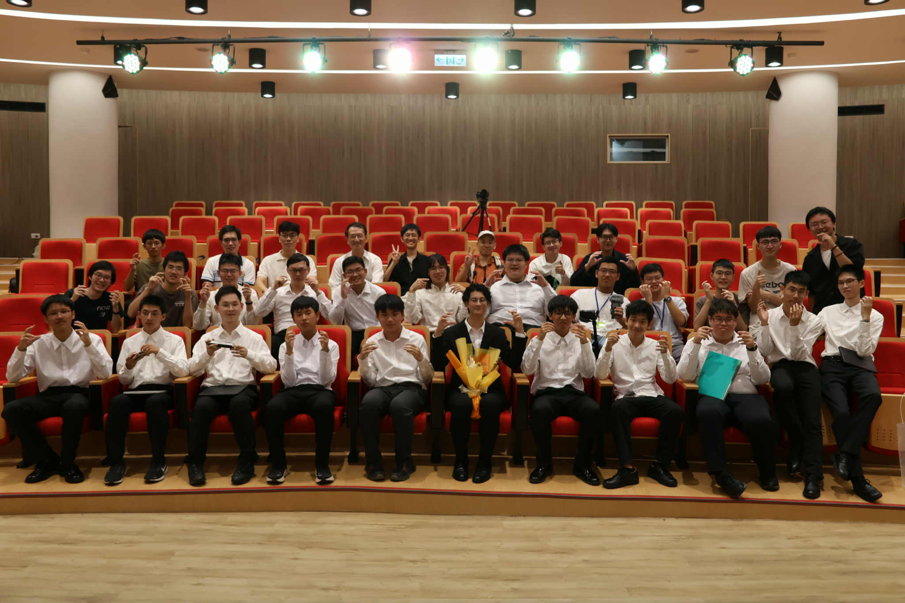

# 口琴能吹什麼？
口琴的曲目非常多元，從古典樂到流行樂、獨奏到重奏及合奏都有。像是節奏輕快的〈比翼鳥〉，炫技的〈大黃蜂的飛行〉，或是〈殘酷天使的行動綱領〉、〈勇者〉等流行歌曲我們都有吹過。

# 口琴社有學長學弟制嗎？
沒有喔，學長們以及指揮、指導屆都很友善，並且會一步一步帶著學弟精進琴藝，也可以一起玩牌、打球！

# 口琴社有什麼活動？
口琴社有許多活動，有與友社的聯合迎新、聖誕遊等，也有校友團練及火鍋會等認識更多學長的機會，更有能夠到宜蘭包棟過夜的寒訓，以及充實訓練的暑訓，當然還有能展現成果的市賽、全國賽及成發。

