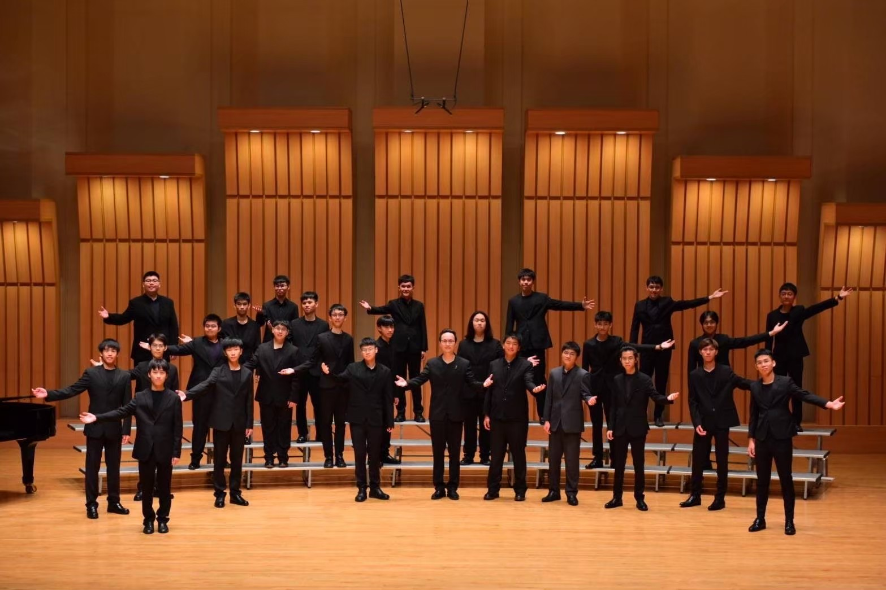

# 關於建中合唱團
建中合唱團共分成四部，根據團員自然音域的不同而分成 T1、T2、B1、B2，各司其職，在指揮的手上匯聚成美麗樂章。帶團風格上也有別於其他高中合唱團由校內音樂教師或外聘指揮主導團務，乃是以「學生」為中心的音樂性社團。除團務充分自治外，各項演出籌劃、交流、展演甚至全國性賽事，盡皆由學生肩負重任；指導老師主要負責處理曲目音樂風格及詮釋，其餘平時訓練均由聲部負責人自行完成。
學生透過深度探索、實際展演，體現高強的意志及領會，即使未能達到自我設定的標準，亦從中習得解決能力，是以本團培育出許多國內優秀的音樂家，前國家交響樂團指揮呂紹嘉、現任臺北愛樂音樂總監暨指揮古育仲、知名作曲家冉天豪皆為本團校友。建中合唱團已傳承 58 載，期待今年能與你一同發光發熱，再創佳績。

# 表演機會
不僅有合唱比賽範唱、紅樓樂語等校內表演與一年一度的成果發表會。每年還會去台灣各地比全國學生音樂比賽、全國師生鄉土歌謠比賽，甚至出國，敬請期待明年日本參加東京國際合唱大賽

# 在這裡，可以得到什麼？
在這裡，你可以收穫一段豐富而多彩的高中生活。不僅有許多比賽與表演的機會，讓你能站上各種舞台、累積經驗，也能在排練與演出中深化對音樂的連結，培養更細膩的藝術感受。此外，合唱團是一個團隊合作的大家庭，在這裡你會認識來自各班的朋友、拓展人脈、結交一生的好友。這不只是唱歌的地方，更是一段充滿熱情與成長的青春旅程。

# 參加音樂性社團會不會影響成績？
在建中合唱團可以培養許多能力，其中良好的時間管理能力尤為重要。面對課業與密集的排練、演出行程，團員們學會如何有效規劃時間、兼顧學習與社團生活，因此多數人依然能在學業上維持優異表現。從過往學長的升學榜單也可以看到，合唱團成員有相當高比例錄取台大，其中也不乏台大法律等頂尖科系，展現了學術與藝術兼備的實力。
