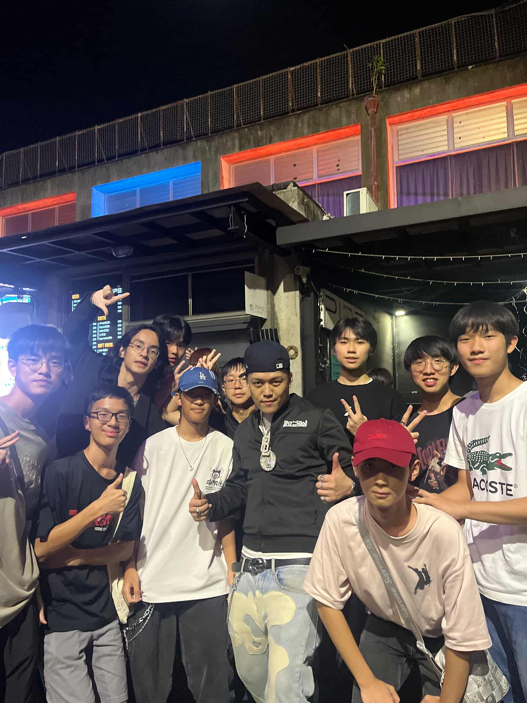

# 嘻研社是啥咪
嘻研是建中最chill的音樂性社團，無論是初次接觸嘻哈、對嘻哈文化有興趣，甚至是自己已經開始創作的人，嘻研都是很適合你的社團。在嘻研認識一群同樣熱愛嘻哈的同儕，一起分享、一起創作，創造充實的社團生活。

# 關於活動
上學期有迎新團康等，促進友校交流，認識更多朋友。學期中也有許多派對活動、成發、表演機會，學弟如果有不錯的作品且有意願，會讓每個人都有上台表演的機會。

# 關於社課
上學期注重於風格探索，搭配創作練習和錄音、混音等基礎教學，我們有最強音樂製作學長坐鎮。目標是讓各位自己能創作、錄製一首Demo。
下學期注重創作能力和表演能力提升，讓每個人都能在成發中大展鴻圖。
小社課時會驗歌，彼此分享自己創作的音樂。想地社的朋友別慌，小社課時可以把自己的作品帶來分享！
