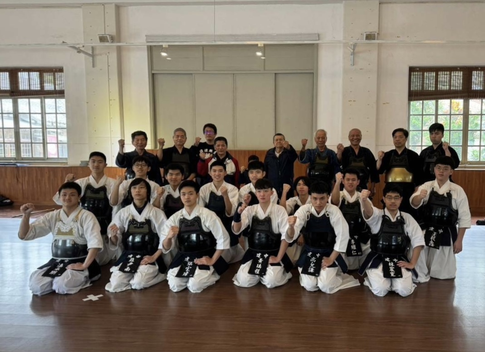
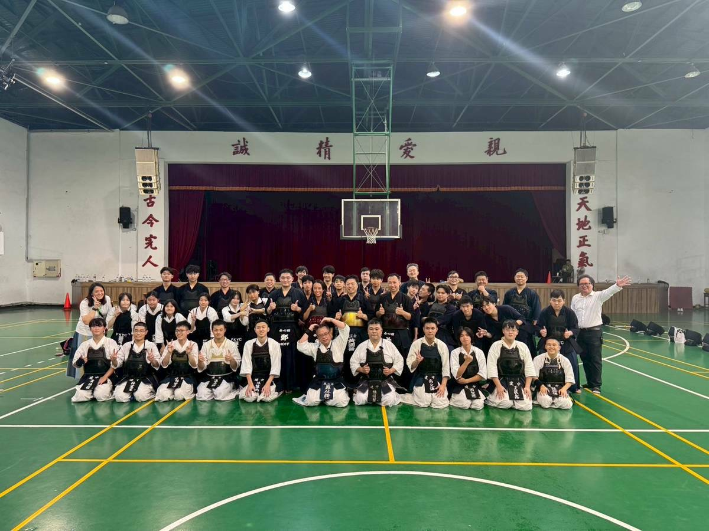

# 劍道社是什麼
建中劍道社作為一個融合武道精神與現代紀律的社團，致力於培養社員的身心素質與劍道技術。我們秉持「劍道即人道」的信念，不只鍛鍊體力、技巧，更強調禮儀、尊重與自律。
無論是初學者還是已有底子的學生，都能在這裡找到自我挑戰與成長的舞台。劍道社也會參與校內外各大賽事，與校友交流，打造屬於建中人的武士魂！

此外，劍道社也固定舉辦各項活動，如期初新生訓練、期末社內賽、寒暑假特訓，以及與大安高工等學校的聯合訓練等，充實並深化社員的修道歷程。

# 劍道精神
劍道不僅是一項運動，更是一種修行。我們重視的，不只是勝負，而是在每一次劈擊中鍛鍊意志，在每一場比劃中學會尊重與克己。
劍道社希望培養的不只是劍士，而是能在人生中貫徹武道精神的現代建中人。
