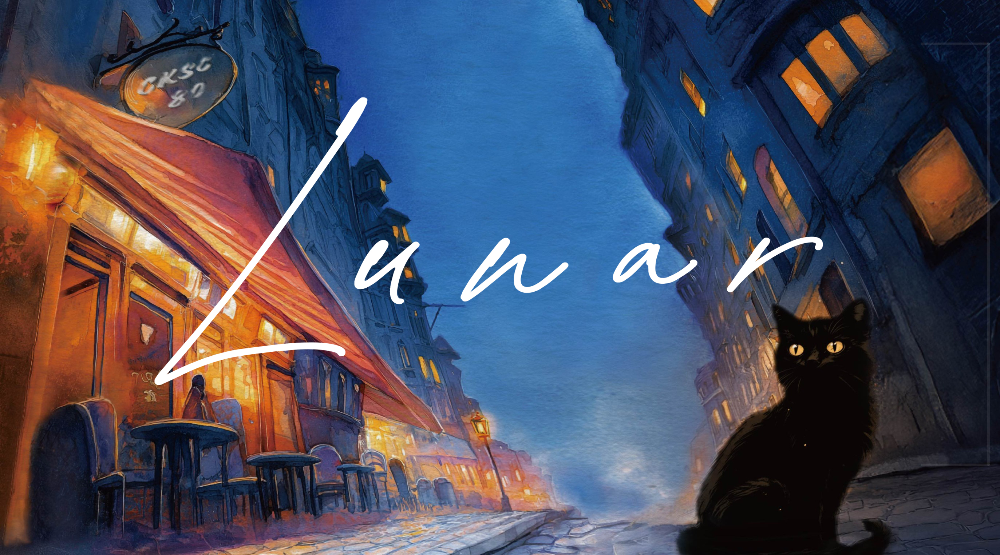

# 今年社聯的主題：Lunar

今年社聯以「Lunar」為名，象徵表演在夜幕低垂、月光灑落的背景中展開。月亮的多變象徵著社團的多元風貌，各具風采卻在同一片夜空中交織出青春的光芒。在這樣的命名下，舞台不僅是才華的展現場域，更是一場在月色映照下共築的夢想旅程，融合浪漫、神秘與團結的意象，賦予整場活動詩意而深遠的意義。

# 什麼是社聯？

「社聯」全名為「社團聯合展演」，是由班聯會策劃主辦的一項年度盛事，邀請建中各社團與友校社團齊聚夢紅樓展演廳，進行一系列精采絕倫的動態表演。從歌唱、舞蹈、魔術，到樂團與樂器演奏，展現各社團獨有的魅力與特色，讓觀眾一次體驗多元社團的精彩風貌。

# 為什麼要舉辦社聯？

社聯旨在讓高一新生更深入了解建中各個社團的風格與特色，作為選社時的重要參考。同時，也為動態型社團提供一個盡情發光的舞台，呈現最熱血動人的一面。不僅歡迎建中師生觀賞，也盛情邀請家長、友校學生與社會大眾一同參與，感受建中社團的活力與創意。

# 社聯是如何籌劃的？

社聯的籌備歷時數月，由總召與副召在四、五月展開整體構想的討論，確認活動主軸、主視覺方向，並完成企劃書撰寫，同時尋找合適的設計與設備廠商，簽訂合約。六月著重於主視覺的定稿與場佈設計；七月進行社團報名資料的整理、拍攝倒數宣傳影片與場佈製作。八月進入最緊鑼密鼓的倒數階段，聚焦於細部流程安排、公關函發送，以及社團彩排時程的排定與調整。

# 社聯開放給誰參加？

社團聯展開放給所有友校同學以及社會大眾參觀，今年的社聯是在 08/22 舉辦，以下是這次的相關資訊！

- **時間：** 2025/08/22 16:20 進場，16:50 開始
- **地點：** 建國中學，夢紅樓展演廳二樓
- **主/承辦單位：** 建中社團活動組&建中班聯會
- **哀居帳號連結：** [ck_club_exhibition\_\_](https://www.instagram.com/ck_club_exhibition__/)

# 歷屆的社聯回顧！

